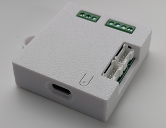
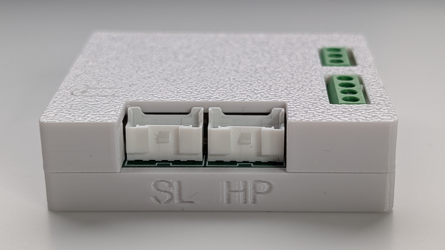
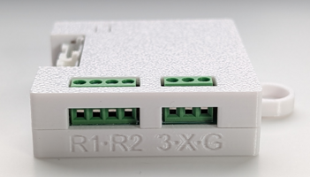
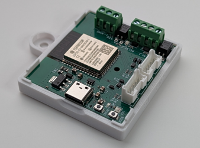
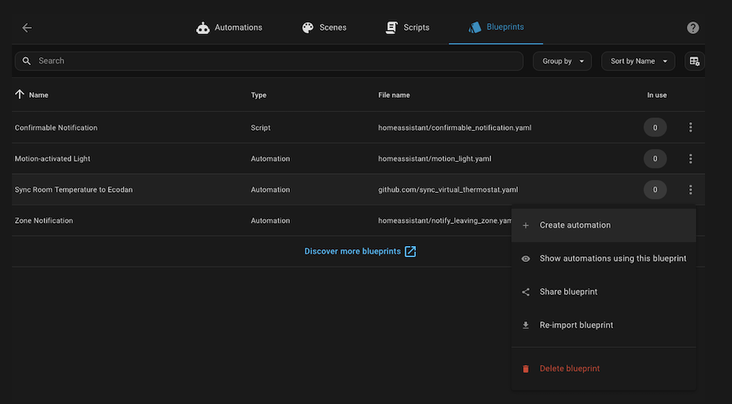
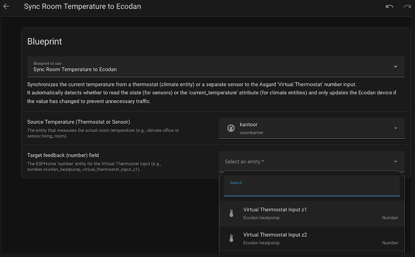

# Asgard PCB - User Manual

Welcome to the manual for the Asgard PCB for Ecodan heatpumps. This board allows you to directly integrate your Mitsubishi Ecodan heat pump into Home Assistant via ESPHome, utilizing the CN105 port.

---

## Ordering & Availability
The **Asgard PCB** will be available for direct purchase here very soon.

* **Product:** Asgard PCB in 3d printed casing + Connector cable
* **Price:** € 65,- (including VAT)
* **Delivery:** Shipped within 3 business days from The Netherlands (When in stock)

> [!NOTE] *The secure payment link will be added to this section once the payment system is live.*

### Shipping & Returns policy
* **Shipping costs:** Calculated at checkout (Available for NL & EU). UK buyers please contact me by email.
* **Returns:** You have the right (EU only) to cancel your order up to 14 days after receipt without giving any reason (right of withdrawal), provided the product is unused and undamaged. The consumer bears the direct cost of returning the goods.
* **Contact:** Do you have questions about an order? Please email: `asgard at iloki dot nl`. For questions about the product, please post them in the [Github section](https://github.com/gekkekoe/esphome-ecodan-hp/discussions/categories/asgard-q-a).

## Quality Assurance & Warranty

> [!NOTE]
> **Professional Assembly & Personal Testing**
> * **PCB:** The circuit board is professionally manufactured and assembled in a specialized **PCBA factory**.
> * **Cables:** I use professionally manufactured and tested cables to ensure reliability.
> * **Final Check:** Every single unit is **personally flashed, inspected, and tested** by the developer before it is packed and shipped to you.

> [!IMPORTANT]
> **Warranty & Liability**
> While this hardware is professionally built, it is sold as a **Do-It-Yourself (DIY) component**.
> 
> * **Limited Warranty:** I provide a **1-year warranty** against manufacturing defects.
> * **Exclusions:** The warranty is **VOID** if failure is caused by user error, such as:
>   * Improper wiring (e.g. short circuits, high voltage on data pins).
>   * Physical modification or soldering by the user.
>   * Water damage or incorrect placement inside the heat pump.
>   * **Accidental damage (e.g. dropping the unit, cracking the 3D printed casing).**
> * **Liability:** Installation is entirely at your own risk. The seller is **not responsible** for any damage to your heat pump, property, or consequential damages resulting from the use or installation of this interface.

---

## Compatibility

### Device Type
This interface is specifically designed for Mitsubishi Electric **Ecodan Air-to-Water** heat pumps (Hydrobox and Cylinder units).

### Co-existence (Slave Port)
The Asgard PCB features a **pass-through (slave) port**, allowing you to retain the functionality of official or third-party modules.

* **Supported:**
    * Modern **MelCloud** Wi-Fi adapters (e.g., MAC-567IF-E).
    * **Procon** Modbus interfaces.
* **Not Supported via Slave Port:**
    * The **PAC-WF010-E**, will **not work** when proxied through the Asgard PCB. These must be disconnected to use this interface.
---

## Contents

Please check if your package contains:
* 1x Asgard PCB (Pre-flashed) in 3D Printed Casing
* 1x Connection Cable (JST-PA to CN105)

---

## 1. Hardware Overview
| Top vieuw | Front view | Side view | Internal view |
| :---: | :---: | :---: | :---: |
|  |  |  |  | 
| *USB-C on the side*| *HP: cn105 to heatpump* |  *R1: first\* 2 inputs for relay 1.* | |
| *reset button on top* | *SL: cn105 to melcloud/procon* | *R2: last\* 2 inputs for relay 2.* | |
| | | *One wire: 3: 3v3, X: data, G: GND* | |
<small>* Left to right orientation</small>

1.  **CN105 Connector:** Connection point for the cable to the heat pump or Melcloud wifi adapter.
    - **HP** port connects to cn105 port of the heatpump
    - **SL** port (Optional) connects to Melcloud/Procon modules
2.  **ESP32 Module:** Main controller.
3.  **Status LED:** Indicates power and Wi-Fi status.
4.  **Boot/Reset Buttons:** Used for manual flashing (recovery mode).
5.  **Temp Sensor Header:** (Optional) For connecting a wired Dallas temperature sensor.
    - **3:** One wire 3v3
    - **X:** One wire data
    - **G:** One wire GND
6.  **Relay Port Header:** (Optional) Connect to IN1/IN6 to use with virtual thermostat.
    - **R1:** Relay 1 input (2 inputs, bidirectional)
    - **R2:** Relay 2 input (2 inputs, bidirectional)

---

## ⚠️ Safety Warnings

> [!DANGER]
> **HIGH VOLTAGE WARNING (230V)**
> The internal unit of your heat pump (Hydrobox/Cylinder Unit) operates on mains voltage.
> * **ALWAYS switch off the power** at the fuse box/breaker panel before opening the casing.
> * Wait at least 5 minutes after switching off power to allow internal capacitors to discharge.
> * Always verify that the power is off using a multimeter.

> [!CAUTION]
> **Manufacturer Warranty**
> Installing third-party hardware inside your heat pump may void the manufacturer's warranty (Mitsubishi Electric). Proceed with caution and common sense. Ensure you ground yourself to prevent Electrostatic Discharge (ESD) when handling the PCB.

---

## 2. Installation Guide

### Step 1: Preparation
1.  Turn off the heat pump via the main controller screen.
2.  **Turn off the power at the breaker panel.**
3.  Remove the front panel of the indoor unit (usually held by 2 screws at the bottom; lift the panel up and out).

### Step 2: Locate the CN105 Port
Look at the main control board of the heat pump for a connector labeled **CN105**.
* It is a **RED** connector with 5 pins.
* It is often located near the corner where the official Wi-Fi module connects.

> [!TIP]
> **MelCloud Conflict:** If you have an official MelCloud Wi-Fi module connected to CN105, you must unplug it. You cannot use MelCloud and the Asgard PCB simultaneously on the same port. Plug the MelCloud module into the **slave port** of the Asgard PCB.

### Step 3: Connect the PCB
1.  Plug the provided cable into the **CN105** port on the heat pump. The plug is keyed and fits only one way. Do not force it.
2.  Plug the other end of the cable into the **Asgard PCB** (Use the **HP** port).
3. [Optional] If you would like to use the virtual thermostat that controls `IN1/IN6` 
    - Single zone 1: connect 2 wires from Asgard PCB `R1` to `IN1` on your main FTC board.
    - Dual zone 2: connect 2 wires from `R2` to `IN6`
4. [Optional] The firmware builtin support for number of DS18x20 temperature sensors.

### Step 4: Mounting
Secure the PCB inside the casing with a screw or 10x2 mm magnet (not supplied). The Asgard PCB can also be mounted outside the unit with a magnet.

### Step 5: Power Up
1.  Reattach the front panel of the heat pump.
2.  Switch the power back on at the breaker panel.
3.  After a few seconds, the LED on the Asgard PCB should light up.

---

## 3. Configuration & Home Assistant

### Connecting to Wi-Fi
On first boot, the Asgard PCB will broadcast a Wi-Fi Hotspot (e.g., `ecodan-heatpump`). Verify that the LED is blue.
1.  Connect to this network with your phone or laptop.
2.  A portal should open automatically. If not, go to `192.168.4.1` in your browser.
3.  Select your home Wi-Fi network and enter the password.
4.  The device will save the settings and reboot.

### Home Assistant Integration
Home Assistant should automatically discover the new ESPHome device under **Settings -> Devices & Services**.
1.  Click **Configure**.
2.  The device is now added! You will see controls for the thermostat, sensors for temperatures, and switches.

### Recommended (If `R1/R2` is connected): Link Room Temperature
To use the "Virtual Thermostat" feature efficiently, the heat pump needs to know your actual room temperature.

1.  Go to the [Blueprints section](https://github.com/gekkekoe/esphome-ecodan-hp/tree/main/asgard/ha_blueprints) of this repository.
2.  Open [setup_sync.md](https://github.com/gekkekoe/esphome-ecodan-hp/blob/main/asgard/ha_blueprints/setup_sync.md) and click on the button to import the blue print.
2.  Execute the **Sync Virtual Thermostat** blueprint, it will ask for the source and destination sensors
3.  Create a new automation, select your room sensor (e.g., Zigbee/Sonoff) and select the Asgard device.
 
 

### Firmware Options (Language & Zone 2)
By default, the unit ships with **English** firmware configured for a **Single Zone** setup.

If you have a 2-zone setup or prefer a different language (e.g., nl, de, fr, da, es, fi, it, no, pl, sv), you can easily update the firmware wirelessly (OTA):

1.  Download the correct OTA Asgard variant firmware binary (example: `asgard-z2-nl-*.ota.bin` for nl and 2 zones) from the [Releases Page](https://github.com/gekkekoe/esphome-ecodan-hp/releases) on GitHub.
2.  Find the IP address of your Asgard device in Home Assistant (or your router).
3.  Open a web browser and go to `http://<YOUR_DEVICE_IP>`.
4.  Scroll to the bottom to the **OTA Update** section.
5.  Upload the `.bin` file you downloaded. The device will update and restart automatically.

### Recovery
You can reset the firmware to factory (example: `asgard-z1-en-*.factory.bin` English single zone) via the usb-c port. 
1. Download the latest **factory** binary from [Releases Page](https://github.com/gekkekoe/esphome-ecodan-hp/releases)
2. Follow the (install) procedure to remove the Asgard PCB from the Ecodan unit. Only unplug the unit when the power (circuit breaker) is off
3. Plug the Asgard PCB in a computer with an usb-c port.
4. Go to https://web.esphome.io/?dashboard_install (Only works in Chrome or Edge), connect the Asgard PCB via usb-c and click connect. Chrome will let you select the detected esp. Finally you click install and select the factory.bin firmware (downloaded in previous step) and flash.
5. Configure WiFi in https://web.esphome.io/?dashboard_install: If you have a recent firmware you can set the WiFi credentials via the three dots menu / Confgure WiFi / Change WiFi. You can skip the next step if the WiFi is configured this way (wait for the led indicator to become blue).
6. Follow the installation procedure to install the Asgard PCB

---

## 4. Troubleshooting

**The LED does not light up:**
* Check if the cable is firmly seated in the CN105 port.
* Verify that the heat pump is powered on.

**The LED is BLUE:**
* The WiFi was not configured or was reset. When the LED is blue, the pcb is in Access point mode. Connect to the wifi with ssid "ecodan-heatpump" and configure the credentials

**Home Assistant does not find the device:**
* Check your router to see if the device is connected to Wi-Fi.
* Try adding it manually in the ESPHome integration using its IP address.

**No data is appearing:**
* It can take up to 1 minute after boot for the first data packets to arrive from the heat pump.
* Ensure you are not using a generic JST cable with wrong wiring order (only use the cable provided).

---

## Legal Disclaimer

This project is open-source and independent. It is not affiliated with, endorsed by, or associated with Mitsubishi Electric. The use of the trade names "Mitsubishi" or "Ecodan" is for identification purposes only.

While every effort has been made to ensure the safety and functionality of this hardware, the end-user assumes all responsibility for installation and usage.