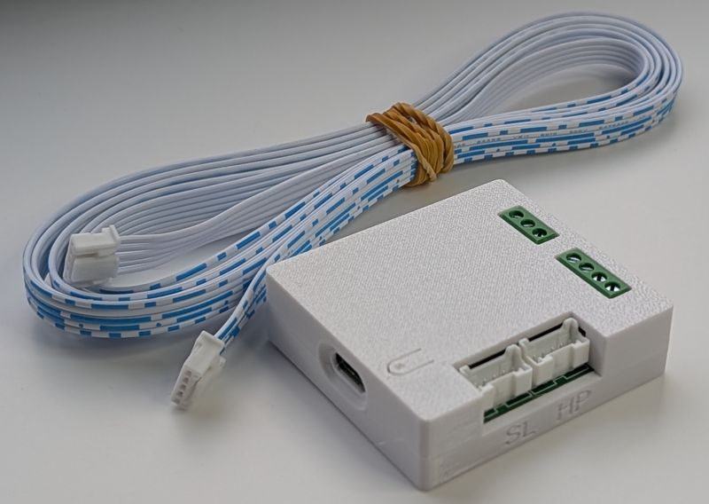

# Buying the Asgard PCB enables you to
* Use virtual thermostats that controls IN1/IN6. This can be used instead of CNRF
* Add high resolution temperature sensors
* Use in single or proxy setup (attach melcloud or procon)
* Use this component without Home Asistant (Fully local, no cloud)
* Have seamless integration with the Solver (not included, seperate product)
* Support this project and allows me to develop/support more features

# Ordering & Availability
* **Product:** Asgard PCB in 3d printed casing + Connector cable
* **Price:** € 65,- (including VAT)
* **Delivery:** Shipped within 3 business days from The Netherlands (When in stock)

 

# ⚡ Asgard is Now Shipping!

| Standard Order (NL/EU) | UK Special Bundle (3 Units) |
| :--- | :--- |
|  |  |

> [!IMPORTANT]
> **Shipping Selection Notice**
> To avoid shipping delays, please ensure you select the correct tier during checkout:
> * **Netherlands (NL):** Select the "Verzending Nederland" shipping option.
> * **European Union (EU):** Select the "Shipping to EU" option for EU countries.
>
> **United Kingdom (UK) Customers:**
> Due to UK VAT regulations, we only process UK orders with a total value exceeding **£135**.
> * **VAT Not Included:** The bundle price excludes UK VAT. UK VAT (20%) will be collected by the carrier upon delivery.
> * **Handling Fees:** Please be aware that the carrier may charge an additional customs clearance handling fee.
> * For custom larger orders, please **contact us via email** to arrange a manual shipment.

### Shipping & Returns policy
* **Shipping costs:** Calculated at checkout (Available for NL & EU). UK buyers please contact me by email.
* **Returns:** You have the right (EU only) to cancel your order up to 14 days after receipt without giving any reason (right of withdrawal), provided the product is unused and undamaged. The consumer bears the direct cost of returning the goods.
* **Contact:** Do you have questions about an order? Please email: `asgard at iloki dot nl`. For questions about the product, please post them in the [Github section](https://github.com/gekkekoe/esphome-ecodan-hp/discussions/categories/asgard-q-a).

## Quality Assurance & Warranty

> [!NOTE]
> **Professional Assembly & Personal Testing**
> * **PCB:** The circuit board is professionally manufactured and assembled in a specialized **PCBA factory**.
> * **Cables:** I use professionally manufactured and tested cables to ensure reliability.
> * **Final Check:** Every single unit is **personally flashed, inspected, and tested** by the developer before it is packed and shipped to you.

> [!IMPORTANT]
> **Warranty & Liability**
> While this hardware is professionally built, it is sold as a **Do-It-Yourself (DIY) component**.
> 
> * **Limited Warranty:** I provide a **1-year warranty** against manufacturing defects.
> * **Exclusions:** The warranty is **VOID** if failure is caused by user error, such as:
>   * Improper wiring (e.g. short circuits, high voltage on data pins).
>   * Physical modification or soldering by the user.
>   * Water damage or incorrect placement inside the heat pump.
>   * **Accidental damage (e.g. dropping the unit, cracking the 3D printed casing).**
> * **Liability:** Installation is entirely at your own risk. The seller is **not responsible** for any damage to your heat pump, property, or consequential damages resulting from the use or installation of this interface.

## Installation Guides

---

## Legal Disclaimer

This project is open-source and independent. It is not affiliated with, endorsed by, or associated with Mitsubishi Electric. The use of the trade names "Mitsubishi" or "Ecodan" is for identification purposes only.

While every effort has been made to ensure the safety and functionality of this hardware, the end-user assumes all responsibility for installation and usage.