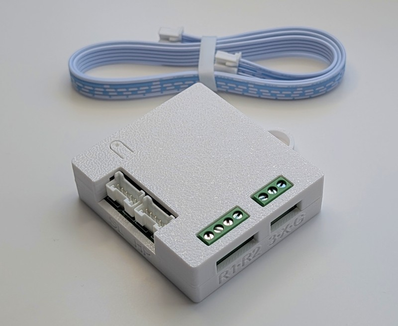

# Asgard PCB: ESP32-S3 Development Sub-assembly
**Integration module for Mitsubishi Ecodan/Zubadan Heat Pumps**

> [!WARNING]
> **DIY DEVELOPMENT KIT STATUS**
> This hardware is a **Sub-assembly / Evaluation Kit**, not a standalone consumer appliance. It is intended for incorporation into a larger system by individuals with technical expertise in electronics and HVAC systems. By purchasing this kit, you acknowledge that you are the **System Integrator** and assume full responsibility for the final installation's safety and compliance.

### Why use the Asgard Sub-assembly?
* Enables Virtual Thermostat control (IN1/IN6) as a modern alternative to CNRF.
* High-resolution temperature sensor integration (DS18B20 support).
* Pass-through (Slave) port functionality for Melcloud or Procon modules.
* 100% Local control (No Cloud dependency).

# Ordering & Availability
* **Product:** Asgard PCB: ESP32-S3 Development Sub-assembly + **50cm** Connector cable
* **Price:** € 65,- (including VAT)
* **Delivery:** Shipped within 3 business days from The Netherlands (When in stock)

  <h2>Order via the link/button below:</h2>

> ⚠️ **Please note that Asgard is currently out of stock, with a new shipment expected in early July.You are welcome to place a backorder, and your item will be dispatched immediately upon restock. The Asgard+Odin bundle is also expected early July.**

| Standard Order (NL/EU) |
| :--- |
| |

 

> [!IMPORTANT]
> **The following FTC controller boards are supported:**
> * **FTC4 (firmware >= 12.01):** Not all commands are supported
> * **FTC5:** Missing `real time` energy consumption estimation 
> * **FTC6/7:**

> [!IMPORTANT]
> **Shipping Selection Notice**
> To avoid shipping delays, please ensure you select the correct tier during checkout:
> * **Netherlands (NL):** Select the "Verzending Nederland" shipping option.
> * **European Union (EU):** Select the "Shipping to EU" option for EU countries.
>
> **United Kingdom (UK) Customers:**
> Due to UK VAT regulations, we only process UK orders with a total value exceeding **£135**.
> * **VAT Not Included:** The bundle price excludes UK VAT. UK VAT (20%) will be collected by the carrier upon delivery.
> * **Handling Fees:** Please be aware that the carrier may charge an additional customs clearance handling fee.
> * For custom larger orders, please **contact us via email** to arrange a manual shipment.

### Shipping & Returns policy
* **Shipping costs:** Calculated at checkout (Available for NL & EU). UK buyers please contact me by email.
* **Returns:** You have the right (EU only) to cancel your order up to 14 days after receipt without giving any reason (right of withdrawal), provided the product is unused and undamaged. The consumer bears the direct cost of returning the goods.
* **Contact:** Do you have questions about an order? Please email: `asgard at iloki dot nl`. For questions about the product, please post them in the [Github section](https://github.com/gekkekoe/esphome-ecodan-hp/discussions/categories/asgard-q-a).

## Quality Assurance & Warranty
> [!IMPORTANT]
> **Warranty & Liability**
> While this hardware is professionally built, it is sold as a **Do-It-Yourself (DIY) component**.
> 
> * **Limited Warranty:** I provide a **1-year warranty** against manufacturing defects.
> * **Exclusions:** The warranty is **VOID** if failure is caused by user error, such as:
>   * Improper wiring (e.g. short circuits, high voltage on data pins).
>   * Physical modification or soldering by the user.
>   * Water damage or incorrect placement inside the heat pump.
>   * **Accidental damage (e.g. dropping the unit, cracking the 3D printed casing).**
> * **Liability:** Installation is entirely at your own risk. The seller is **not responsible** for any damage to your heat pump, property, or consequential damages resulting from the use or installation of this interface.

## Installation Guides

To get started, complete the physical hardware installation, then choose your preferred software configuration.

| Step | User Path | Guide |
| :--- | :--- | :--- |
| **1. Hardware** | All Users |  |
| **2. Software** | Home Assistant |  |
| | Standalone (Quick AA Setup) |  |
| | Standalone (Full Config) |  |

---

## Legal Disclaimer

This project is open-source and independent. It is not affiliated with, endorsed by, or associated with Mitsubishi Electric. The use of the trade names "Mitsubishi" or "Ecodan" is for identification purposes only.

While every effort has been made to ensure the safety and functionality of this hardware, the end-user assumes all responsibility for installation and usage.