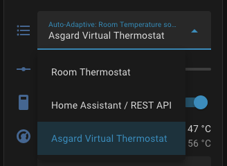
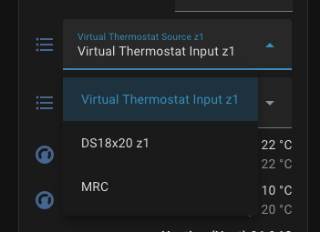
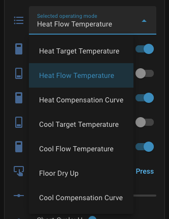

## Home Assistant Adaptive Installation Guide (Asgard only)
| Room temp Source | Virtual Thermostat: Temp sensor | Operating mode |
| :---: | :---: | :---: |
| ! | |  |

### Configure Asgard for Auto Adaptive
1.  Use the `Auto Adaptive: Room Temp Source` selection box to select the room temperature source. `Choose Asgard virtual thermostat` 
2.  Use the `Virtual Thermostat: Temp Sensor Source` selection box to select the temperature sensor source for the virtual thermostat. 
    * Virtual Thermostat input: Use the Link Room Temperature section below to link a temperature sensor in Home Assistant.
    * Ds18x20: Use this option if you are using the dallas temperature sensors
    * MRC: Use this option if you don't have any external temperature sensors. The temperature sensor is located within the main display. Please beware of the low resolution (0.5c) of this option.
3.  Use the `Operating Mode` selection box to select `Heat Flow Temperature` 
4.  Enable the Auto Adaptive `Enable/Disable` switch to enable the auto adaptive algorithm
5.  Click `APPLY ZONE 1` 
6.  [Optional] For 2 zone systems: Apply Step 1 - 3 

### If `R1/R2` is connected: Link Room Temperature
To use the "Virtual Thermostat" feature efficiently, the heat pump needs to know your actual room temperature.

1.  Go to the [Blueprints section](https://github.com/gekkekoe/esphome-ecodan-hp/tree/main/asgard/ha_blueprints) of this repository.
2.  Open [setup_sync.md](https://github.com/gekkekoe/esphome-ecodan-hp/blob/main/asgard/ha_blueprints/setup_sync.md) and click on the button to import the blue print.
2.  Execute the **Sync Virtual Thermostat** blueprint, it will ask for the source and destination sensors
3.  Create a new automation, select your room sensor (e.g., Zigbee/Sonoff) and select the Asgard device.
 
 
