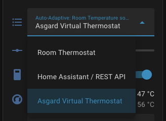
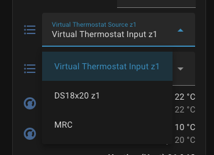
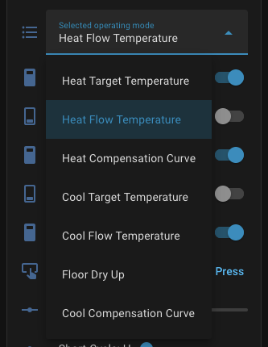
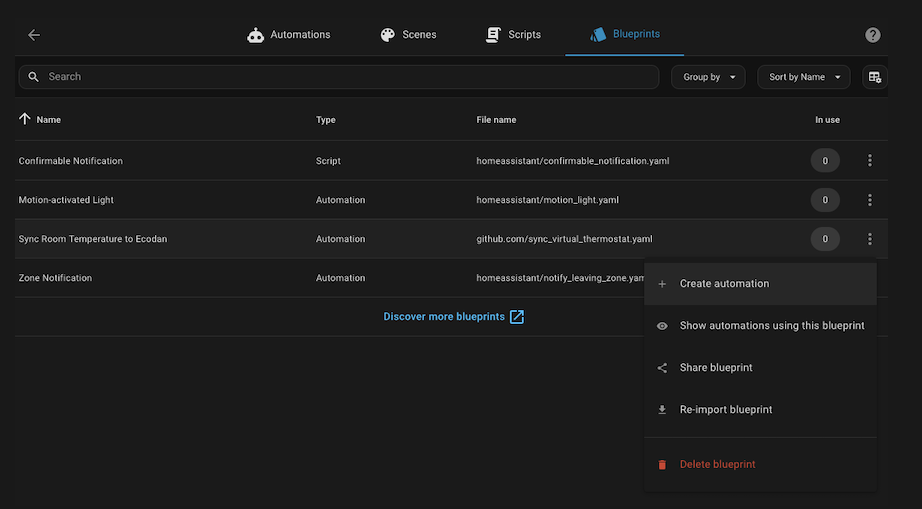
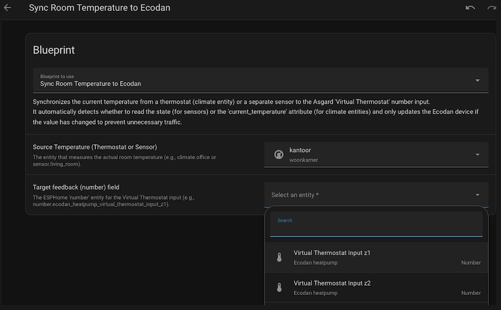

# Home Assistant — Auto Adaptive Setup (Asgard)

This guide sets up **Auto Adaptive Control** from Home Assistant. It assumes the
Asgard PCB is installed and already added to Home Assistant as an ESPHome device
(see the [Hardware Manual](manual.md) and, if needed, the
[Standalone guide](sa-config.md) for what each setting means).

Everything below is configured through the entities Home Assistant exposes for
your Asgard device — no dashboard access required.

| Room Temp Source | Virtual Thermostat: Temp Sensor | Operating Mode |
| :---: | :---: | :---: |
|  |  |  |

---

## Step 1 — Configure Auto Adaptive

1. Set **Auto Adaptive: Room Temp Source** to the source Auto Adaptive should
   read the room temperature from:
   - **Asgard Virtual Thermostat** — uses the R1/R2 relay signal and its room
     temperature (requires R1/R2 wired).
   - **Home Assistant / REST API** — a value you push from Home Assistant (use
     this if R1/R2 is not wired). See [Link Room Temperature](#step-2--link-room-temperature-r1r2-wired).
   - **Room Thermostat** — the Mitsubishi MRC or wireless thermostat.
2. If you chose **Asgard Virtual Thermostat**, set **Virtual Thermostat: Temp
   Sensor Source**:
   - **Virtual Thermostat Input** — temperature pushed via the REST API or the
     Home Assistant blueprint below.
   - **DS18x20** — a wired Dallas sensor on the Asgard One Wire header.
   - **MRC** — the sensor in the main display. Note the low resolution (0.5 °C);
     use only if you have no other sensor.
3. Set **Operating Mode** to **Heat Flow Temperature**.
4. Turn on the **Auto Adaptive: Enable/Disable** switch.
5. Press **Apply Zone 1**.
6. **Two-zone systems:** repeat steps 1–3 for Zone 2, then press **Apply Zone 2**.

> For cooling, choose **Cool Flow Temperature** instead. For the full meaning of
> every Auto Adaptive number (min/max flow, setpoint bias, smart boost, …) see
> the [Standalone Setup guide](sa-config.md#step-3--configure-auto-adaptive-settings).

---

## Step 2 — Link Room Temperature (R1/R2 wired)

For the Virtual Thermostat to work efficiently, the heat pump needs your actual
room temperature. The easiest way is the provided Home Assistant blueprint,
which keeps any Home Assistant temperature sensor (e.g. a Zigbee/Sonoff sensor)
in sync with the Asgard virtual thermostat.

1. Open the [Blueprints folder](https://github.com/gekkekoe/esphome-ecodan-hp/tree/main/asgard/ha_blueprints)
   in this repository.
2. Follow [setup_sync.md](https://github.com/gekkekoe/esphome-ecodan-hp/blob/main/asgard/ha_blueprints/setup_sync.md)
   and click the button to import the **Sync Virtual Thermostat** blueprint.
3. Create a new automation from the blueprint. Select your room sensor as the
   source and your Asgard device as the destination.

| Create automation | Automation detail |
| :---: | :---: |
|  |  |

Prefer to push the temperature yourself (Node-RED, a script, etc.)? Asgard also
exposes a REST API — see
[Configure via REST API](sa-config.md#configure-virtual-thermostat-room-temperature-via-rest-api).

---

## Next steps

- **Short-cycle protection and lockout:** see
  [Standalone Setup → Step 4](sa-config.md#step-4--optional-apply-short-cycle-lockout).
- **ODIN solver integration:** enable the Solver tab as described in
  [Standalone Setup → Enabling the Solver Tab](sa-config.md#enabling-the-solver-tab-odin-integration).
