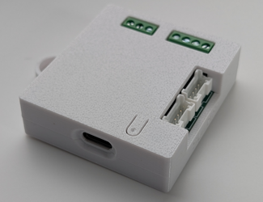
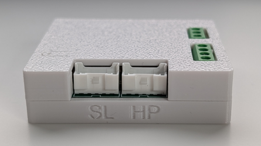
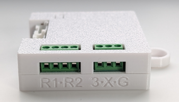
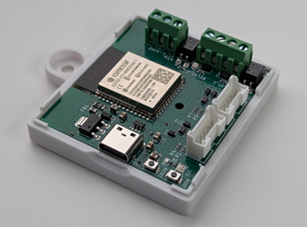
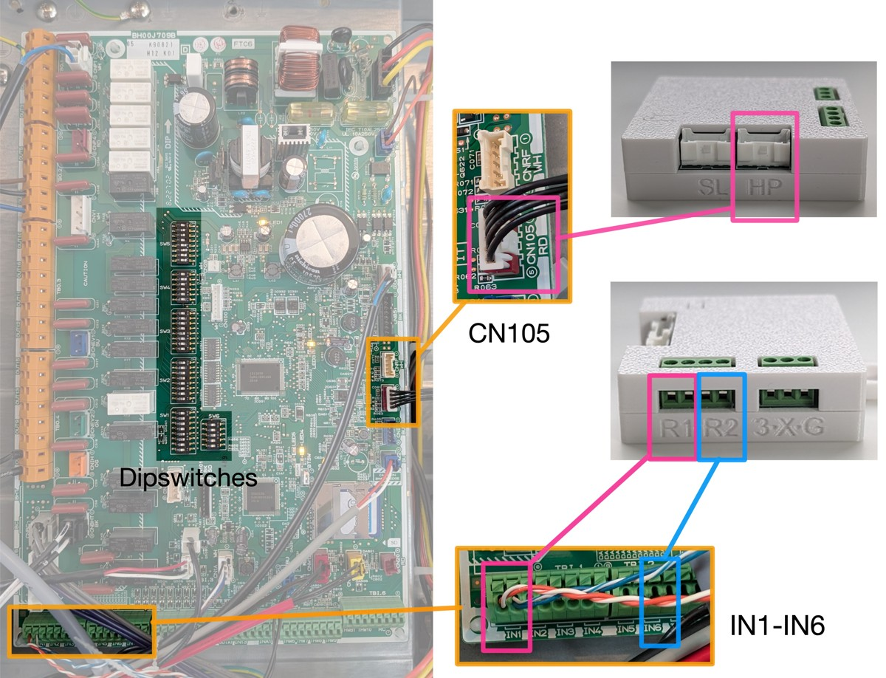

# Asgard PCB - Technical Integration Manual

> [!IMPORTANT]
> **Warranty & Liability (Component Level)**
> This hardware is professionally manufactured but is classified as a **Do-It-Yourself (DIY) Sub-assembly**.
>
> * **Module Warranty:** A **1-year warranty** covers manufacturing defects of the PCB itself.
> * **Liability Limitation:** As the manufacturer of this sub-assembly, I have no control over the final installation environment. Installation is performed entirely at the user's risk. The seller is **not liable** for damage to the heat pump, property, or any consequential damages (e.g., loss of heating) resulting from the use or installation of this component.
> * **System Integrity:** Integrating third-party hardware may void your Mitsubishi Electric manufacturer warranty.

## Prerequisites for Installation
To safely integrate this module, you should be familiar with:
1. **Basic Electrical Safety:** Specifically working around 230V mains voltage.
2. **ESD Protection:** Handling sensitive electronics without causing static damage.
3. **ESPHome / Home Assistant:** Configuring and deploying YAML-based firmware (optional, for HA users).

---

## Compatibility

### Device Type
This interface is specifically designed for Mitsubishi Electric **Ecodan/Zubadan Air-to-Water** heat pumps (Hydrobox and Cylinder units).

> [!IMPORTANT]
> **The following FTC controller boards are supported:**
> * **FTC4 (firmware >= 12.01):** Not all commands are supported
> * **FTC5:** Missing real-time energy consumption estimation
> * **FTC6 / FTC7:** Full support

### Co-existence (Slave Port)
The Asgard PCB features a **pass-through (slave) port**, allowing you to retain the functionality of official or third-party modules.

* **Supported via slave port:**
    * Modern **MelCloud** Wi-Fi adapters (e.g., MAC-567IF-E)
    * **Procon** Modbus interfaces
* **Not supported via slave port:**
    * The **PAC-WF010-E** will **not work** when proxied through the Asgard PCB. These must be disconnected to use this interface.

---

## Contents

Please check that your package contains:
* 1× Asgard PCB in 3D Printed Casing
* 1× Connection Cable (JST-PA to CN105) — 50 cm

---

## 1. Hardware Overview

| Top view | Front view | Side view | Internal view |
| :---: | :---: | :---: | :---: |
|  |  |  |  |
| *USB-C on the side* | *HP: CN105 to heat pump* | *R1: first 2 inputs for relay 1* | |
| *Reset button on top* | *SL: CN105 to MelCloud/Procon* | *R2: last 2 inputs for relay 2* | |
| | | *One Wire: 3=3V3, X=data, G=GND* | |

<small>* Left to right orientation</small>

1. **CN105 Connector:** Connection point for the cable to the heat pump or MelCloud adapter.
   - **HP** port connects to the CN105 port of the heat pump
   - **SL** port *(optional)* connects to MelCloud/Procon modules
2. **ESP32 Module:** Main controller.
3. **Status LED:** Indicates power and Wi-Fi status.
4. **Boot/Reset Buttons:** Used for manual flashing (recovery mode).
5. **Temp Sensor Header:** *(optional)* For a wired Dallas temperature sensor.
   - **3:** One Wire 3V3
   - **X:** One Wire data
   - **G:** One Wire GND
6. **Relay Port Header:** *(optional)* Connect to IN1/IN6 for virtual thermostat control.
   - **R1:** Relay 1 — connect to IN1 on the FTC board
   - **R2:** Relay 2 — connect to IN6 on the FTC board (Zone 2 only)

---

## ⚠️ Safety Warnings

> [!DANGER]
> **HIGH VOLTAGE WARNING (230V)**
> The internal unit of your heat pump operates on mains voltage.
> * **ALWAYS switch off the power** at the fuse box before opening the casing.
> * Wait at least **5 minutes** after switching off power to allow internal capacitors to discharge.
> * Do not connect USB-C to a computer or power outlet when Asgard is connected and powered by the heat pump.
> * Always verify power is off using a multimeter before touching any internal wiring.

> [!CAUTION]
> **Manufacturer Warranty**
> Installing third-party hardware inside your heat pump may void the Mitsubishi Electric manufacturer warranty. Ensure you ground yourself to prevent ESD when handling the PCB.

---

## 2. Installation Guide

### Step 1: Preparation
1. Turn off the heat pump via the main controller screen.
2. **Turn off the power at the breaker panel.**
3. Remove the front panel of the indoor unit (usually held by 2 screws at the bottom; lift up and out).

### Step 2: Locate the CN105 Port
Look at the main control board for a connector labelled **CN105**.
* It is a **RED** 5-pin connector.
* Usually located near the corner where the official Wi-Fi module connects.

> [!TIP]
> **MelCloud Conflict:** If you have an official MelCloud module connected to CN105, unplug it from CN105 and plug it into the **slave (SL) port** on the Asgard PCB instead.

### Step 3: Connect the PCB
1. Plug the provided cable into the **CN105** port on the heat pump. The plug is keyed — do not force it.
2. Plug the other end into the **HP** port on the Asgard PCB.
3. **[Optional] Virtual thermostat wiring:**
   - Zone 1: connect 2 wires from Asgard **R1** to **IN1** on the FTC board. Ensure **SW2-1** is in the **ON** position.
   - Zone 2: connect 2 wires from Asgard **R2** to **IN6** on the FTC board. Ensure **SW3-1** is in the **ON** position.
4. **[Optional]** Connect a DS18B20 temperature sensor to the One Wire header.

> [!TIP]
> **Migrating from wireless thermostats (CNRF):** Ensure **SW1-8** is in the **OFF** position when using virtual thermostats.



### Step 4: Mounting
Secure the PCB inside the casing with a screw or a 10×2 mm magnet (not supplied). Asgard can also be mounted outside the unit with a magnet.

### Step 5: Power Up
1. Reattach the front panel.
2. Switch the power back on at the breaker panel.
3. After a few seconds, the LED on the Asgard PCB should light up.

---

## 3. First-Time Configuration

### Connecting to Wi-Fi

On first boot, Asgard broadcasts a Wi-Fi hotspot named `ecodan-heatpump`. The LED will be **blue**.

1. Connect to this network with your phone or laptop. Default password: `configesp`
2. A captive portal should open automatically. If not, navigate to `http://ecodan-heatpump.local` in a browser.
3. Select your home Wi-Fi network, enter the password, and save.
4. Asgard reboots and joins your home network.

Once on your network, the dashboard is available at:
```
http://ecodan-heatpump.local/dashboard
```

### Dashboard Navigation

The dashboard has three main tabs:

| Tab | Purpose |
|-----|---------|
| **Monitor** | Live charts — temperatures, compressor frequency, COP performance stats |
| **Settings** | All configuration: zones, Auto Adaptive, DHW, Advanced Control |
| **Logs** | Live activity log with Pause / Clear / Download controls |

A fourth **Solver** tab for ODIN integration is hidden by default. Enable it via **Settings → Advanced Control → Odin Solver → Show Solver Tab**.

### Configuring Auto Adaptive

All Auto Adaptive configuration is done in the dashboard Settings tab. Follow the appropriate guide:

* **Standalone (no Home Assistant):** [Standalone Setup Guide](sa-config.md)
* **With Home Assistant:** [Home Assistant Setup Guide](ha-config.md)

### Home Assistant Integration *(optional)*

Home Assistant automatically discovers Asgard as an ESPHome device under **Settings → Devices & Services**. Click **Configure** to add it. HA integration is optional — Asgard runs fully standalone without it.

---

## 4. Firmware

### Language & Zone Variants

By default, Asgard ships with **English** firmware for a **Single Zone** setup.

For a 2-zone system or a different language (nl, de, fr, da, es, fi, it, no, pl, sv), update the firmware wirelessly:

1. Download the correct OTA binary from the [Releases Page](https://github.com/gekkekoe/esphome-ecodan-hp/releases)
   - Example filename: `asgard-z2-nl-*.ota.bin` (Dutch, 2 zones)
2. Open `http://<asgard-ip>` in a browser
3. Scroll to the **OTA Update** section
4. Upload the `.bin` file — Asgard will update and restart automatically

### Recovery (USB)

If the device is unresponsive over Wi-Fi, flash via USB-C:

1. Download the latest **factory** binary from the [Releases Page](https://github.com/gekkekoe/esphome-ecodan-hp/releases)
   - Example: `asgard-z1-en-*.factory.bin`
2. Unplug the Asgard PCB from the heat pump (power off at breaker first)
3. Connect Asgard to a computer via USB-C
4. Open [https://web.esphome.io/](https://web.esphome.io/) in Chrome or Edge
5. Click **Connect**, select the detected ESP, click **Install**, and choose the factory binary
6. After flashing, configure Wi-Fi via the three-dots menu → **Configure WiFi → Change WiFi**
7. Reinstall Asgard in the heat pump

---

## 5. Troubleshooting

**The LED does not light up:**
* Check that the cable is firmly seated in the CN105 port.
* Verify that the heat pump is powered on at the breaker.

**The LED is blue:**
* Wi-Fi was not configured or has been reset. Asgard is in access point mode. Connect to the `ecodan-heatpump` Wi-Fi hotspot and configure credentials.

**Home Assistant does not find the device:**
* Confirm the device is connected to Wi-Fi by checking your router's device list.
* Add it manually in the ESPHome integration using its IP address.

**No data is appearing in the dashboard:**
* It can take up to 1 minute after boot for the first data packets to arrive from the heat pump.
* Ensure you are using the cable supplied — generic JST cables may have incorrect wiring order.

**Heat pump stops after DHW or Legionella completes:**
* This is a known behaviour being addressed. After a DHW/Legionella run, if ODIN is enabled, Asgard will automatically resume with the next scheduled hour's heating plan rather than stopping. Ensure you are on the latest firmware.

---

## Legal Disclaimer

This project is independent and is not affiliated with, endorsed by, or associated with Mitsubishi Electric. The use of the trade names "Mitsubishi" or "Ecodan" is for identification purposes only.

While every effort has been made to ensure the safety and functionality of this hardware, the end-user assumes all responsibility for installation and usage.
