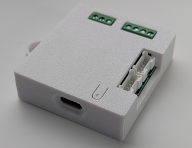
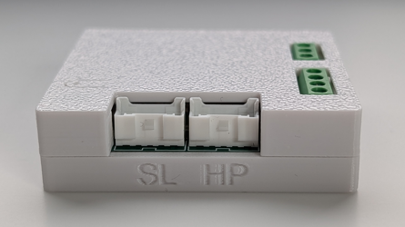
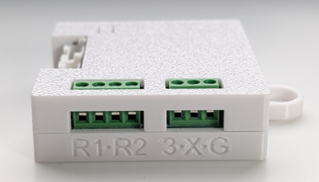
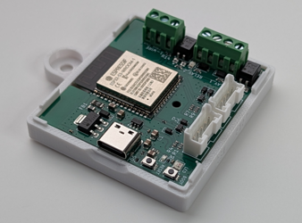
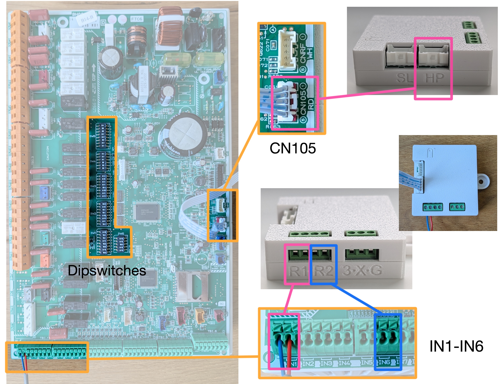
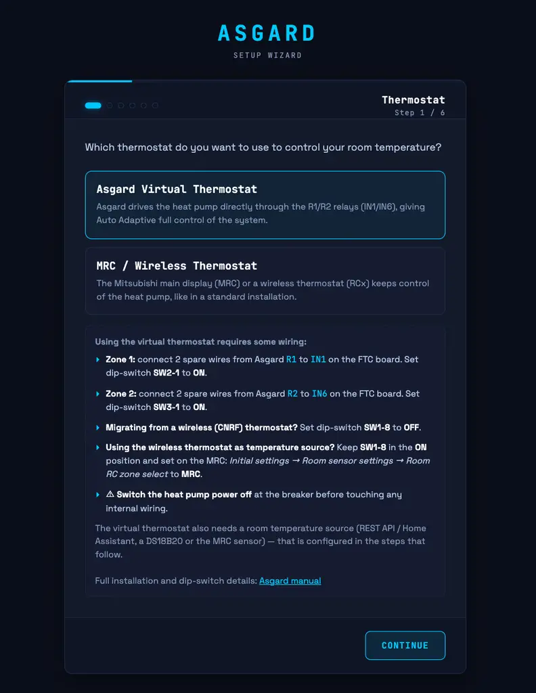
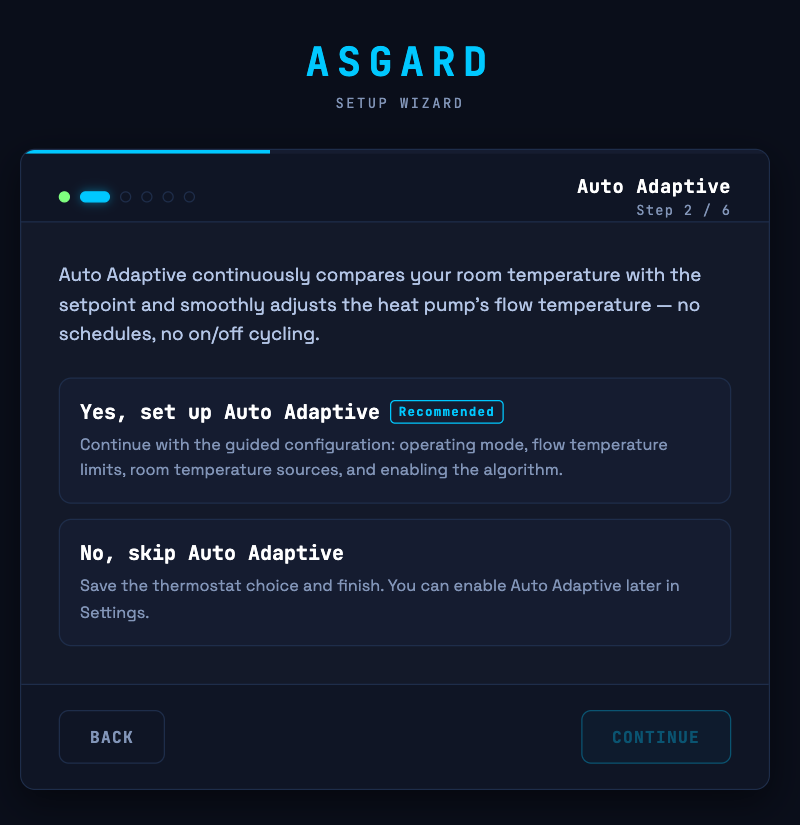
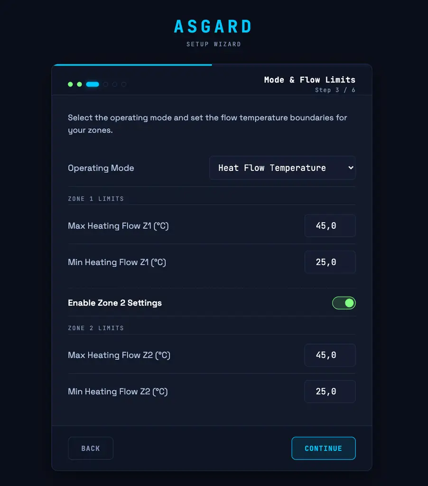

# Asgard Getting Started Guide

> **Asgard** — Local integration module for Mitsubishi Ecodan/Zubadan Air-to-Water heat pumps. This guide walks you through the hardware installation, first boot, the Auto Adaptive setup wizard, firmware updates, and a complete description of every tab and setting in the standalone dashboard.

> [!NOTE]
> **This guide is a living document.** Asgard is in ongoing development, so this manual may occasionally lag behind the latest firmware. Outdated sections are corrected as features are refined — if you spot something that no longer matches your device, it will be updated in due time. Have a question or found an error? Raise it in the [GitHub Discussions](https://github.com/gekkekoe/esphome-ecodan-hp/discussions).

---

## Table of Contents

1. [What You Need](#1-what-you-need)
2. [Compatibility & Known Limitations](#2-compatibility--known-limitations)
3. [License, Usage Conditions & Warranty](#3-license-usage-conditions--warranty)
4. [Hardware Overview](#4-hardware-overview)
5. [Safety Warnings](#5-safety-warnings)
6. [Installation](#6-installation)
7. [First Boot — Wi-Fi Setup](#7-first-boot--wi-fi-setup)
8. [Auto Adaptive Setup Wizard (Optional)](#8-auto-adaptive-setup-wizard-optional)
9. [Navigating the Dashboard](#9-navigating-the-dashboard)
10. [Monitor Tab](#10-monitor-tab)
11. [Settings — Zones 1 & 2](#11-settings--zones-1--2)
12. [Settings — Auto Adaptive](#12-settings--auto-adaptive)
13. [Settings — DHW & Legionella](#13-settings--dhw--legionella)
14. [Settings — Advanced Control](#14-settings--advanced-control)
15. [Solver Tab (ODIN Module)](#15-solver-tab-odin-module)
16. [System Tab](#16-system-tab)
17. [Firmware — Variants, OTA & USB Recovery](#17-firmware--variants-ota--usb-recovery)
18. [REST API & Dashboard Endpoints](#18-rest-api--dashboard-endpoints)
19. [Home Assistant (Optional)](#19-home-assistant-optional)
20. [Quick-Start Checklist](#20-quick-start-checklist)
21. [Troubleshooting](#21-troubleshooting)
22. [Legal Disclaimer](#22-legal-disclaimer)

---

## 1. What You Need

- **Asgard hardware** in its 3D printed casing + 50 cm connector cable (JST-PA to CN105)
- **A Mitsubishi Electric Ecodan/Zubadan Air-to-Water heat pump** (Hydrobox or Cylinder unit)
- **Optional:** 2 spare wires to connect the **R1** relay to **IN1** on the FTC board (Zone 1 virtual thermostat), and **R2** to **IN6** (Zone 2 only)
- **Optional:** a wired **DS18B20** Dallas temperature sensor for the One Wire header
- **Optional:** a screw or a 10×2 mm magnet (not supplied) for mounting
- **A 2.4 GHz Wi-Fi network** and a phone or laptop with a browser to complete initial setup
- Basic knowledge of your installation: single or two zones, heating system type (underfloor heating / radiators), DHW tank size

> **Note:** Asgard is a standalone, local device — it requires no cloud subscription or external account. All control, logging, and the dashboard run on the device itself. Home Assistant integration is optional (see [Section 19](#19-home-assistant-optional)).

---

## 2. Compatibility & Known Limitations

While Asgard is highly capable, it is important to set the right expectations regarding what the system can and cannot do:

- **Supported heat pumps:** Mitsubishi Electric **Ecodan/Zubadan Air-to-Water** units (Hydrobox and Cylinder units).

  **The following FTC controller boards are supported:**

  | FTC board | Status |
  |-----------|--------|
  | **FTC4 (firmware ≥ 12.01)** | Supported — not all commands are available |
  | **FTC5** | Supported — **no real-time energy consumption** reporting. Asgard falls back to the daily reported consumption, so the per-hour energy bars in the dashboard will not display a value. If you need hourly energy data, install an energy meter and link it in Home Assistant. |
  | **FTC6 / FTC7** | Full support |

- **Proxy (pass-through) port:** the **SL/PX** port lets you keep an official or third-party module connected alongside Asgard.
  - **Supported via proxy:** modern MelCloud Wi-Fi adapters (e.g. **MAC-567IF-E**) and **Procon** Modbus interfaces.
  - **Not supported via proxy:** the **PAC-WF010-E** Wi-Fi module will **not** work when proxied through the Asgard PCB. It must be disconnected to use this interface.

- **Room temperature sensor resolution:** Auto Adaptive works best with a room sensor that reports at **0.1 °C resolution** (e.g. a wired DS18B20, or a Home Assistant sensor. REST API can also be used to push sensor data). The sensor in the main Mitsubishi display (MRC) or a wireless thermostat (RCx) only reports in **0.5 °C steps** — use it only if no other sensor is available.
- **Virtual thermostats:** the R1/R2 relay inputs (IN1/IN6) are what allow Asgard to directly start/stop the heat pump. If you do not wire them, Auto Adaptive can still run by reading the room temperature from another source (MRC, REST API), but Asgard can then only act through the heat pump's own climate modes.
- **Legionella scheduling:** Asgard can automate the DHW setpoint while a Legionella run is active (see [Section 13](#13-settings--dhw--legionella)), but the Legionella run itself is scheduled by the heat pump's internal timer.
- **Wi-Fi:** the ESP32-S3 module connects to **2.4 GHz** networks only.

---

## 3. License, Usage Conditions & Warranty

Asgard is provided under a strict home-use agreement. By using the Asgard software and hardware, you agree to the following terms and conditions:

- **DIY Sub-assembly Status:** This hardware is a **sub-assembly / evaluation kit**, not a standalone consumer appliance. It is intended for incorporation into a larger system by individuals with technical expertise in electronics and HVAC. By purchasing the kit, you acknowledge that you are the **system integrator** and assume full responsibility for the final installation's safety and compliance.
- **Personal / Home Use Only:** The system is intended strictly for private, residential use.
- **Disclaimer of Liability:** The creators of Asgard are not responsible for any damage to your property, heating system, or home caused by using this hardware or software. Users are required to actively monitor the system to ensure it is behaving correctly and safely. Please be extra vigilant **especially when cooling**, as improper cooling operation can lead to condensation and water damage.
- **Manufacturer Warranty:** Installing third-party hardware inside your heat pump may void the Mitsubishi Electric manufacturer warranty.
- **Limited Warranty:** A **1-year warranty** is provided against **manufacturing defects** of the PCB.
  - **Exclusions:** the warranty is **VOID** if the failure is caused by user error, such as:
    - Improper wiring (e.g. short circuits, high voltage on data pins)
    - Physical modification or soldering by the user
    - Water damage or incorrect placement inside the heat pump
    - **Accidental damage (e.g. dropping the unit, cracking the 3D printed casing)**

---

## 4. Hardware Overview

| Top view | Front view | Side view | Internal view |
| :---: | :---: | :---: | :---: |
|  |  |  |  |
| *USB-C on the side* | *HP: CN105 to heat pump* | *R1: first 2 inputs for relay 1* | |
| *Reset button on top* | *SL/PX: CN105 to MelCloud/Procon* | *R2: last 2 inputs for relay 2* | |
| | | *One Wire: 3/P=Power, X=data, G=GND* | |

<small>* Left to right orientation</small>

1. **CN105 Connector** — connection point for the cable to the heat pump or a MelCloud adapter:
   - **HP** port connects to the CN105 port of the heat pump
   - **SL/PX** port *(optional)* connects to a MelCloud/Procon module (proxy)
2. **ESP32-S3 Module** — main controller.
3. **Status LED** — indicates power and Wi-Fi status.
4. **Boot/Reset Buttons** — used for manual flashing (recovery mode).
5. **Temp Sensor Header** *(optional)* — for a wired Dallas DS18B20 sensor:
   - **3 / P:** One Wire power
   - **X:** One Wire data
   - **G:** One Wire GND

   <small>If your case is marked **3**, the power pin is 3.3 V. If it is marked **P**, the power pin is 5 V.</small>
6. **Relay Port Header** *(optional)* — for virtual thermostat control:
   - **R1:** Relay 1 — connect to **IN1** on the FTC board (Zone 1)
   - **R2:** Relay 2 — connect to **IN6** on the FTC board (Zone 2 only)

**Package contents:** 1× Asgard PCB in 3D printed casing, 1× connection cable (JST-PA to CN105, 50 cm).

---

## 5. Safety Warnings

> [!DANGER]
> **HIGH VOLTAGE WARNING (230 V)**
> The internal unit of your heat pump operates on mains voltage.
> * **ALWAYS switch off the power** at the breaker panel before opening the casing.
> * Wait at least **5 minutes** after switching off power to allow internal capacitors to discharge.
> * Do **not** connect USB-C to a computer or power outlet while Asgard is connected to and powered by the heat pump.
> * Always verify the power is off using a multimeter before touching any internal wiring.

> [!CAUTION]
> **Manufacturer Warranty & ESD**
> Installing third-party hardware inside your heat pump may void the Mitsubishi Electric manufacturer warranty. Ground yourself to prevent ESD damage when handling the PCB.

---

## 6. Installation

### Step 1 — Preparation

1. Turn off the heat pump via the main controller (MRC) screen.
2. **Turn off the power at the breaker panel.**
3. Remove the front panel of the indoor unit (usually held by 2 screws at the bottom; lift up and out).
4. Check that the package contains the PCB (in casing) and the 50 / 200 cm connection cable.

### Step 2 — Locate the CN105 Port

Look at the main control board for a connector labelled **CN105**.

- It is a **RED** 5-pin connector.
- It is usually located near the corner where the official Wi-Fi module connects.

> [!TIP]
> **MelCloud conflict:** if you have an official MelCloud module connected to CN105, unplug it from CN105 and plug it into the **proxy (SL/PX) port** on the Asgard PCB instead — you keep MelCloud functionality while Asgard sits on CN105.

### Step 3 — Connect the PCB

1. Plug the provided cable into the **CN105** port on the heat pump. The plug is keyed — do not force it.
2. Plug the other end into the **HP** port on the Asgard PCB.

> [!TIP]
> **Monitoring only?** If you only want to monitor the heat pump — without a virtual thermostat, or a wired temperature sensor — you do **not** need to do points 3–5. Skip straight to [Step 4 — Mounting](#step-4--mounting) and continue from there.
3. **[Optional] Virtual thermostat wiring** *(recommended for Auto Adaptive control)*:
   - Zone 1: connect 2 wires from Asgard **R1** to **IN1** on the FTC board. Ensure dip-switch **SW2-1** is in the **ON** position.
   - Zone 2: connect 2 wires from Asgard **R2** to **IN6** on the FTC board. Ensure dip-switch **SW3-1** is in the **ON** position.
4. **[Optional]** Connect a **DS18B20** temperature sensor to the One Wire header (power, data, GND).
5. **[Optional]** Connect a MelCloud/Procon module to the **SL/PX** proxy port.

> [!TIP]
> **Migrating from wireless thermostats (CNRF):** ensure **SW1-8** is in the **OFF** position when using virtual thermostats.
>
> **Using the wireless thermostat as the temperature source for the virtual thermostat:** leave **SW1-8** in the **ON** position, and on the MRC set *Initial settings → Room sensor settings → Room RC zone select* so the **Master Room Sensor z1/z2** is **MRC** instead of RRCx.



### Step 4 — Mounting

Secure the Asgard inside the casing with a screw or a 10×2 mm magnet (not supplied). Asgard can also be mounted **outside** the unit with a magnet.

### Step 5 — Power Up

1. Reattach the front panel.
2. Switch the power back on at the breaker panel.
3. After a few seconds, the LED on the Asgard PCB should light up.

---

## 7. First Boot — Wi-Fi Setup

When Asgard boots for the first time (or after a Wi-Fi reset) it cannot connect to your home network yet. It creates its own temporary access point so you can configure it. The LED will be **blue** while in this mode.

### Step 1 — Connect to the Asgard access point

On your phone or laptop, open the Wi-Fi settings and look for a network named:

```
ecodan-heatpump
```

Connect to it. Password: `configesp`

### Step 2 — Complete the Wi-Fi configuration

A captive portal should open automatically. If not, navigate to `http://ecodan-heatpump.local` in a browser. Select your home Wi-Fi network, enter the password, and save. Asgard reboots and joins your home network.

### Step 3 — Find Asgard on your network

After the Wi-Fi is saved the access point disappears and the LED changes state. Asgard is then accessible via its local address:

```
http://ecodan-heatpump.local
```

The standalone dashboard lives at:

```
http://ecodan-heatpump.local/dashboard
```

> **Tip:** Assign a **static IP** to Asgard in your router settings (DHCP reservation using Asgard's MAC address) so the address never changes. You can find the current IP in your router's connected devices list.

---

## 8. Auto Adaptive Setup Wizard (Optional)

The **Auto Adaptive Wizard** is a guided 4-step process that configures everything Auto Adaptive needs. It runs standalone — no Home Assistant required. The wizard is **optional** — everything it configures can also be set manually in the Settings tab (see [Section 12](#12-settings--auto-adaptive)).

Navigate to:

```
http://ecodan-heatpump.local/dashboard/setup
```

The wizard pre-fills any values already stored on the device, so re-running it is safe and non-destructive. You can also apply the same settings manually later in the Settings tab (see [Section 12](#12-settings--auto-adaptive)).

### Step 1 — Mode & Flow Limits



Choose your operating mode and set the safe boundaries for your flow temperatures. The available fields change dynamically based on the selected mode:

| Field | Description |
|-------|-------------|
| **Operating Mode** | `Heat Flow Temperature` for heating, `Cool Flow Temperature` for cooling. Auto Adaptive only works in a Flow Temperature mode. |
| **Max / Min Heating Flow** *(heating)* | The absolute maximum and minimum water flow temperatures Auto Adaptive is allowed to command for this zone. |
| **Global Smart Start Temp** *(cooling)* | The upper-bound flow temperature for the first command when a cooling cycle starts. The calculated flow is always clamped between `[Min Cooling Flow]` and `[Smart Start Temp]`. Applies globally to all zones. |
| **Min Cooling Flow** *(cooling)* | The absolute minimum cooling flow temperature. Set it to a safe limit (e.g. 18 °C for floor cooling) to **avoid condensation** — it must stay above your home's dew point. |
| **Enable Zone 2 Settings** | Toggle this on if your system has a secondary heating/cooling circuit. |

### Step 2 — Zone 1 Sensors



Configure where the Auto Adaptive algorithm gets its room temperature data for Zone 1.

**Room Temp Source:**

| Option | Description |
|--------|-------------|
| **Room Thermostat** | You are using the Mitsubishi MRC or a wireless thermostat (or the CNRF project). |
| **Home Assistant / REST API** | Reads the room temperature from a value pushed via the REST API or a Home Assistant automation/blueprint. Use this when you did not wire R1/R2. |
| **Asgard Virtual Thermostat** | Uses the Virtual Thermostat relay (R1/R2) as both the control signal and the room temperature source. Requires R1/R2 to be wired. |

If you chose **Asgard Virtual Thermostat**, also set the **Temp Sensor Source** — where the actual temperature data comes from:

| Option | Description |
|--------|-------------|
| **Virtual Thermostat Input** | A sensor feeding the temperature via the REST API (e.g. a Home Assistant automation/blueprint). |
| **DS18x20 (Dallas)** | A wired DS18B20 sensor physically connected to the One Wire header on the Asgard PCB. |
| **MRC (Main Display)** | The sensor inside the main Mitsubishi display. *Warning: low resolution (0.5 °C steps) — use only if no other sensor is available.* |

### Step 3 — Zone 2 Sensors

Identical layout to Step 2 for the second zone (Room Temp Source + Temp Sensor Source). If you left **Enable Zone 2 Settings** off in Step 1, this step is skipped.

### Step 4 — Enable



| Control | Description |
|---------|-------------|
| **Enable AA Control** | Toggle this to activate the Auto Adaptive algorithm. When enabled, Asgard continuously monitors the delta between the room temperature and the setpoint and adjusts the heat pump's flow temperature in the background. |

---

## 9. Navigating the Dashboard

The standalone dashboard is served by the device itself at `http://ecodan-heatpump.local/dashboard`. It has four tabs:

| Tab | Purpose |
|-----|---------|
| **Monitor** | Live charts — system status timeline, temperatures, compressor frequency, condenser performance, COP stats |
| **Settings** | All configuration: zones, Auto Adaptive, DHW, Advanced Control |
| **Solver** | ODIN integration — hidden by default, enabled in Advanced Control (see [Section 15](#15-solver-tab-odin-module)) |
| **System** | Settings backup, firmware updates (OTA), system logs |

### Header

The top header shows live status badges, refreshed every 5 seconds:

| Badge | Description |
|-------|-------------|
| **Mode** | Current heat pump mode: Off, Hot Water, Heating, Cooling, Frost Protect, Legionella |
| **Feed / Return** | Current feed and return water temperatures |
| **Delta T** | Feed minus return temperature difference |
| **Ambient** | Outdoor temperature |
| **Freq** | Compressor frequency (Hz) |
| **Flow** | Water flow rate |
| **Output** | Current computed output power |
| **Prod / Cons** | Daily heat produced / electricity consumed |
| **DHW** | DHW tank temperature |
| **Starts** | Compressor starts today |
| **Run** | Compressor runtime |
| **WiFi** | Wi-Fi signal strength |

The firmware version is shown in the top-right corner next to the **last update** time. When a newer firmware release is available on GitHub, a warning icon appears next to the version — click it to jump to the Firmware card in the System tab.

### Data storage

- **Live state** is polled from the device every 5 seconds.
- **Minute-level chart history** is stored on the device for **7 days** — use the Calendar view in Monitor and Solver to browse it.
- **Hourly aggregates** are retained for up to **2 years** and feed the daily physics averages in the Solver tab.
- **ODIN data** (the last 72 hours of plans, prices, and weather) is cached on the device and survives reboots.

---

## 10. Monitor Tab

The **Monitor** tab is the main real-time view of your heat pump.

### Time View

At the top of the tab you can switch between:

- **Live** — the last 24 hours, continuously updated.
- **Calendar** — pick a **Date** and a **Range** (1, 2 or 3 days) to browse the stored history (up to 7 days back).

### System Status Timeline

A horizontal timeline showing which mode the heat pump spent each period in: **Off**, **Hot Water (DHW)**, **Heating**, **Cooling**, **Frost Protect**, and **Legionella**. Use it to verify when DHW runs happened, whether defrost/frost protection triggered, or why the unit sat idle.

### Temperatures

The main temperature chart with a **Reset Zoom** button:

| Line | Description |
|------|-------------|
| **Feed** | Feed water temperature |
| **Return** | Return water temperature |
| **Z1 Target / Z2 Target** | The room temperature targets set for each zone |
| **Z1 Current / Z2 Current** | The measured room temperature for each zone |
| **Z1 Flow Setpoint / Z2 Flow Setpoint** | The flow temperature setpoint being commanded for each zone (dashed) |

The chart is zoomable — drag to select a time range, then use **Reset Zoom** to go back to the full view.

### Compressor Frequency

Compressor frequency over time, **colour-coded by mode**: Heating (orange), Cooling (blue), DHW (amber), Legionella (green), Defrost (purple), Booster (red). This makes it easy to see how hard the compressor worked and in which mode.

### Condenser Performance

| Line | Description |
|------|-------------|
| **Ambient** | Outdoor temperature |
| **Liquid Pipe 1** | Liquid pipe temperature |
| **Condensing** | Condensing temperature |

Useful for spotting refrigerant-side issues (e.g. abnormal liquid pipe temperature relative to ambient).

### Performance

Daily efficiency statistics for each mode:

| Mode | Fields |
|------|--------|
| **Heating** | COP, electricity in (kWh) / heat out (kWh) |
| **Cooling** | COP, electricity in (kWh) / cooling out (kWh) |
| **DHW** | COP, electricity in (kWh) / heat out (kWh) |

> **Note:** on **FTC5** boards the per-hour energy values are not available (see [Section 2](#2-compatibility--known-limitations)) — daily totals are used as a fallback.

---

## 11. Settings — Zones 1 & 2

The Settings tab is divided into cards: **Zone 1**, **Zone 2** (two-zone builds only), **Auto Adaptive**, **DHW**, and **ADVANCED CONTROL**.

### Zone 1

#### Operating Mode

The Ecodan controller's own operating mode for this zone:

| Option | Description |
|--------|-------------|
| **Heat Target Temperature** | Heat the room to a target temperature (normal heating mode). |
| **Heat Flow Temperature** | Command a target **flow** temperature. |
| **Heat Compensation Curve** | Flow temperature follows an outdoor-temperature compensation curve. |
| **Cool Target Temperature** | Cool the room to a target temperature. *⚠ Can drive the flow temperature very low, creating a high risk of condensation on the emitters.* |
| **Cool Flow Temperature** | Command a target flow temperature in cooling. |
| **Floor Dry Up** | Mitsubishi's floor-drying mode. |
| **Cool Compensation Curve** | Flow temperature follows a cooling compensation curve. |

> Auto Adaptive (Section 12) only works in a **Flow Temperature** mode.

#### Flow Climate Z1

*Shown when the operating mode is a Flow Temperature mode.*

Shows the current flow temperature and a setpoint stepper (0.1 °C steps). Use **Apply Flow Z1** to command the heat pump directly. This is the manual override for the flow temperature.

#### Use Room Thermostat Z1

Turn **on** when you want the heat pump controlled by the Mitsubishi MRC or wireless thermostat (no virtual thermostat). When **off**, the Virtual Thermostat panel below becomes active.

#### Virtual Thermostat Z1

The relay-driven room control that lets Asgard directly signal the heat pump to start/stop via the R1 relay input (IN1). A status dot next to the title shows the relay state.

| Control | Description |
|---------|-------------|
| **Thermostat Mode** | `Heat` / `Cool` / `Off`. Must match what the heat pump is actually doing — set to `Off` if you want to control the relay manually. |
| **Temp Sensor Source** | Where the virtual thermostat reads the room temperature: **Virtual Thermostat Input** (pushed via REST API or Home Assistant blueprint), **DS18x20** (wired Dallas sensor), or **MRC or RCx** (main display or wireless thermostat — 0.5 °C resolution). |
| **Current / Setpoint** | The live room temperature and a setpoint stepper (0.1 °C steps). |
| **Hysteresis** | Deadband around the setpoint before the relay switches on/off (0.1–3.0 °C). Wider = fewer on/off cycles but more temperature swing; narrower = tighter control but more cycling. |
| **Apply Virtual Thermostat Z1** | Saves the mode, sensor source, setpoint, and hysteresis. |

#### Room Thermostat Z1

*Shown when **Use Room Thermostat Z1** is on.*

Shows the current room temperature from the MRC/wireless thermostat and a setpoint stepper (0.5 °C steps). **Apply Room Thermostat Z1** sends the setpoint to the heat pump.

### Zone 2

Identical controls for the second zone (R2 relay / IN6). The Zone 2 card is only present in **two-zone firmware builds** and is hidden on single-zone systems.

---

## 12. Settings — Auto Adaptive

Auto Adaptive is Asgard's built-in flow-temperature algorithm: it continuously compares your room temperature against the setpoint and smoothly adjusts the heat pump's flow temperature — no fixed schedule, no on/off cycling.

### General Settings

| Control | Description |
|---------|-------------|
| **Enable AA Control** | Master switch for the Auto Adaptive algorithm. Must be on for it to run. |
| **Defrost Mitigation** | Adjusts Auto Adaptive behaviour in conditions where ice formation on the outdoor unit is likely — reduces defrost frequency and the associated indoor temperature dips (e.g. by lowering the flow temperature in the minutes before a predicted defrost). |
| **Smart Boost** | Temporarily raises the flow temperature target when the room is stagnating below setpoint, to recover faster than gradual adaptive control alone would — without long overshoots. |

### General Zone Settings

| Control | Description |
|---------|-------------|
| **Heating System Type** | Your emitter type — underfloor heating, radiators, or a mix. Used to set safe min/max flow-temperature deltas and defrost-recovery timing. Options: `UFH`, `UFH *`, `UFH + Radiators`, `UFH + Radiators *`, `Radiators`, `Radiators *`. The `*` variants use modified (linear) response curves — choose the closest match to your system. |
| **Setpoint Bias** | A flat offset (±5 °C, 0.1 °C steps) added to whatever flow temperature Auto Adaptive calculates. Positive if the room consistently runs cold, negative if it consistently overshoots. |
| **Global Smart Start Temp** | Ceiling (16–25 °C, 0.5 °C steps) on the flow temperature for the **first command** when a cooling cycle starts, so the system doesn't demand a fully-cold flow while the emitter water is still warm from sitting idle. Once the compressor is actively cooling, this cap is lifted. Shared across both zones. |

### Settings Z1

| Control | Description |
|---------|-------------|
| **Room Temp Source Z1** | Where Auto Adaptive reads the room temperature (see below). |
| **Room Temp Value** | The live temperature of the selected source — the value Auto Adaptive actually uses for this zone. |
| **HA / REST API Temp** | *Only shown when the source is Home Assistant / REST API.* A manually editable copy of the pushed temperature (e.g. for testing without a live sensor). |
| **Max Flow Z1** | Upper flow-temperature bound Auto Adaptive is allowed to command (30–65 °C, 0.1 °C steps). Keep this below the absolute system limit of your heat pump. |
| **Min Flow Z1** | Lower flow-temperature bound (20–55 °C, 0.1 °C steps). Prevents the heat pump short-cycling because the calculated setpoint is too low to sustain operation. |
| **Min Cool Flow Z1** | *Cooling mode only.* Minimum chilled-water flow temperature (5–25 °C, 0.1 °C steps). **Dew point warning:** ensure this value is above your home's dew temperature to prevent condensation on the emitters. |

**Room Temp Source options:**

| Option | Description |
|--------|-------------|
| **Room Thermostat** | The Mitsubishi MRC or wireless thermostat (or CNRF project). |
| **Home Assistant / REST API** | Reads the temperature from a value pushed via the REST API or a Home Assistant blueprint. Use this when you did not wire R1/R2. See [Section 18](#18-rest-api--dashboard-endpoints). |
| **Asgard Virtual Thermostat** | Uses the Virtual Thermostat relay (R1/R2) as the control signal and its room temperature as the source. Requires R1/R2 to be wired. |

### Settings Z2

The same set of controls for the second zone (Room Temp Source Z2, Max/Min Flow Z2, Min Cool Flow Z2). Only shown in two-zone builds when Zone 2 is in use.

Click **Apply Settings** to save all Auto Adaptive values.

---

## 13. Settings — DHW & Legionella

### DHW Triggers

| Control | Description |
|---------|-------------|
| **Force DHW Now** | Triggers an immediate **non-ECO** (forced) DHW cycle — the heat pump heats the tank at full power regardless of the current mode. |
| **Trigger Regular DHW** | Triggers an **ECO** mode DHW cycle — the heat pump schedules the DHW heating in its normal energy-saving fashion. |

### DHW Status & Setpoint

| Field | Description |
|-------|-------------|
| **Setpoint** | The current DHW setpoint on the heat pump. |
| **Drop** | The temperature drop below the setpoint at which the heat pump starts recovering the tank. |
| **Consumed / Produced** | Electricity consumed / heat delivered for DHW today. |
| **Tank Temp / Setpoint** | The live tank temperature and a setpoint stepper (40–60 °C, 0.5 °C steps). **Apply DHW** saves the setpoint. |

### Legionella Prevention

When enabled, Asgard handles the DHW setpoint automatically while a Legionella Prevention run is active — no manual setpoint changes needed:

| Control | Description |
|---------|-------------|
| **Enable** | When the heat pump starts a Legionella run, the DHW setpoint is raised to the **Legionella Setpoint** and the previous value is stored. When the run finishes, the stored setpoint is restored. |
| **Legionella Setpoint** | (50–60 °C, 0.5 °C steps) DHW setpoint applied while a Legionella run is active. The compressor heats the water up to this setpoint efficiently — only the part above it is done by the booster element. Set it as high as your heat pump tolerates to minimize booster element usage. |
| **Stored Setpoint** | *(read-only)* The DHW setpoint stored at the start of a Legionella run; restored when the run finishes. Shows — when nothing is stored. |
| **Apply Legionella** | Saves the Legionella Setpoint. |

> [!NOTE]
> If you already run a Home Assistant automation that raises the DHW setpoint during Legionella runs, remove it — Asgard handles this internally now.

---

## 14. Settings — Advanced Control

The **ADVANCED CONTROL** card contains five collapsible sub-sections.

### Power & Modes

| Control | Description |
|---------|-------------|
| **Power** | Power On / Stand-by for the whole heat pump. |
| **Service Codes** | Enables service-codes mode to read additional diagnostic sensors (compressor starts, pipe temperatures, super/subcool, fan speed). **Turn OFF before manually reading codes from your MRC display** and turn back ON when done. Always return to the MRC main screen before toggling — service codes will not work otherwise. |
| **Holiday Mode** | Enables Holiday Mode on the heat pump, overriding normal scheduling. |

### Odin Solver

| Control | Description |
|---------|-------------|
| **Show Solver Tab** | Shows or hides the **Solver** navigation tab in this dashboard. Enable it when you use ODIN (see [Section 15](#15-solver-tab-odin-module)). |

### Server Control

Server Control lets you override the heat pump's behaviour from the dashboard (and from Home Assistant/REST API):

| Control | Description |
|---------|-------------|
| **Enable Server Control** | Master switch for the prohibit controls below. |
| **Prohibit DHW** | Blocks the heat pump from running **any** DHW cycle — regardless of tank temperature, schedule, or manual triggers — until turned back off. |
| **Prohibit Z1 Heating** | Blocks the heat pump from heating Zone 1, regardless of schedule or Auto Adaptive. |
| **Prohibit Z1 Cooling** | Blocks the heat pump from cooling Zone 1. |
| **Prohibit Z2 Heating / Z2 Cooling** | Same for Zone 2 (two-zone builds). |

### Predictive Control

| Control | Description |
|---------|-------------|
| **Enable** | Keeps the flow-temperature target within ~1 °C of the actual feed temperature on every reading (below it in heating, above it in cooling) so a drifting feed can't cross the compressor's cut-off and halt it — preventing short cycles. |

### Short Cycle Lockout

Protects the compressor from very short run cycles:

| Control | Description |
|---------|-------------|
| **Lockout Status** | Shows whether a lockout is currently active and the remaining duration. An **✕** button cancels an active lockout manually. |
| **Lockout Strategy** | **Server Control** — enables Server Control and prohibits the active zone/mode, then restores the prior controller flags afterwards. **Flow Control** — pushes the flow setpoint 5 °C past the current actual feed temperature (colder in cooling, warmer in heating) so the unit self-satisfies and the compressor stops while the water pump keeps circulating; the original setpoint is restored afterwards. |
| **Lockout Duration (min)** | How long the lockout holds: 0 (disabled), 15, 30, 45, 60, 120, or 240 minutes. |
| **Minimum On-Time (min)** | How long the compressor must have already been running before Predictive Control or Short Cycle Lockout will act (1–20 min). Prevents very short heating/cooling cycles that wear the compressor. |
| **Apply Lockout Settings** | Saves the strategy, duration, and minimum on-time. |

---

## 15. Solver Tab (ODIN Module)

The **Solver** tab is where you connect Asgard to an **ODIN** (Dynamic Cost Optimizer) device, monitor the optimisation results, and fine-tune the physics parameters the solver uses to model your house. **This section only applies if you own and use an ODIN module** — without one, the tab stays hidden and you can ignore it entirely.

> **To show the Solver tab:** go to **Settings → ADVANCED CONTROL → Odin Solver** and enable **Show Solver Tab**. The tab will appear in the navigation bar.

### 15.1 Time View

Like the Monitor tab, the Solver tab can show **Live** data or a **Calendar** view (date + 1/2/3 day range) from the cached ODIN data (last 72 hours, stored on the device).

### 15.2 Odin Settings

| Control | Description |
|---------|-------------|
| **Enable Dynamic Cost Solver** | Lets ODIN's hourly plan (electricity price + weather + solar optimised) drive the heat pump instead of Asgard's standalone Auto Adaptive control. When enabled, Asgard fetches a new optimisation plan from ODIN every hour and uses it to control the heat pump relay. |
| **Connection Status** | `ONLINE` / `OFFLINE` — Asgard automatically probes ODIN on your local network (mDNS) every 60 seconds. |
| **Odin IP Address** | Manual override for ODIN's IP (recommended — much faster than mDNS, and required on routers that block mDNS). Click **✓** to save. Once a valid IP is stored, the **Open ODIN** button appears — it opens the ODIN dashboard directly. |
| **DHW Threshold** | If the DHW temperature drops below `(Target − Drop) + Threshold`, ODIN tries to schedule the DHW cycle during an upcoming cheap or sunny hour. Set to **0** to disable ODIN DHW scheduling. The current probe temperature is shown below the stepper. |
| **ODIN DHW Trigger** | **Regular** — ODIN schedules DHW using ECO mode. **Forced** — faster, but at the cost of higher consumption. |
| **Run Optimization** | Triggers an immediate solve so you can preview how setting changes affect the plan *(preview only — it is replaced by the next regular hourly refresh)*. The **From hour** field (0–23) overrides the start hour; leave it blank to use the current hour. |

### 15.3 Physics Data (Daily Averages)

This section shows the values Asgard sends to ODIN with every solve request. They are derived automatically from your heat pump's real measured data over the past day *(they are only auto-populated after a heating or cooling session has actually taken place)*. You can override any value manually and click **Apply Physics Data** to force specific values for testing — Asgard uses your overrides until the next automatic daily update.

**Heating Profile:**

| Field | Description |
|-------|-------------|
| **Heat Produced** | Total heat energy produced (last session) in heating mode, DHW excluded. Together with Electricity Consumed this gives your actual COP. |
| **Electricity Consumed** | Electricity used (last session) in heating mode, DHW excluded. `COP = Heat / Electricity`. |
| **Runtime** | Hours the heat pump ran in heating mode (last session). Used to derive the thermal mass of your house. |
| **Avg Ambient Temp** | Average outdoor temperature (last session). Used to calculate heat loss and COP correction. |
| **Heating Avg Room** | Average room temperature on heating days. Pairs with Avg Ambient Temp to determine the heat loss coefficient. |
| **Zone 2 fields** | *(two-zone builds)* The same per-zone values for Zone 2, plus **Delta Room Z2** (daily temperature swing — small delta = high thermal mass). |

**Cooling Profile:**

| Field | Description |
|-------|-------------|
| **Cooling Produced** | Total cooling energy produced (last session). Used to calculate EER. |
| **Cool Electricity Consumed** | Electricity used in cooling mode (last session). `EER = Cooling / Electricity`. |
| **Cooling Runtime** | Hours the heat pump ran in cooling mode (last session). |
| **Cooling Avg Ambient** | Average outdoor temperature (last session) during cooling. |
| **Cooling Avg Room** | Average room temperature on cooling days. Kept separate from the heating value to prevent seasonal drift. |

**Universal Building Physics:**

| Field | Description |
|-------|-------------|
| **Delta Room Temp** | Max minus min room temperature yesterday (daily swing, 0–10 °C). Small delta = high thermal mass — the house holds heat well. |
| **HL × TM Product (Tau)** | Thermal time constant of your house in hours (0–300 h, typical 50–300 h). Describes how slowly the house loses heat when the heat pump is off. **Learned automatically** from night-time cooldown periods. |
| **Passive Solar Factor** | Heat entering through windows per W/m² of solar irradiance (0.001–0.05 kWh/W/m², typical 0.010–0.030). Independent of PV panels. **Learned automatically** from heat-pump-off periods on sunny days. |
| **Battery SoC** | Current state of charge of a home battery, in kWh. ODIN uses this to recommend which hours to discharge it to cover heat pump electricity costs (recommendation only — it does not control your battery). Set **0** if you have no battery. |
| **Battery Max Discharge** | Maximum discharge rate of your battery in kW (0.5–15). ODIN will never assign more than this to any single hour. |

### 15.4 Solver Charts

The bottom of the tab shows the day's plan and reality side by side (24 h, or the selected calendar range):

| Chart | Description |
|-------|-------------|
| **Room Temperatures (24h)** | **Scheduled** (your comfort target per hour), **Expected** (what ODIN predicted when it made the plan, per zone), and **Actual** (measured room temperature, per zone). The x-axis labels are colour-coded by the **planned** mode of each hour (Heating / Cooling / DHW), and a thin strip above the lines shows the **actual** mode that ran. |
| **Energy Consumption (24h)** | Hourly electricity consumption — **Exp. Grid** (expected from grid), **Exp. Solar** (expected covered by solar), and **Actual**. |
| **Energy Production (24h)** | Hourly heat/cooling production — **Exp. Climate** (expected thermal), **Exp. Solar**, and **Actual**. |
| **Cost (24h)** | Expected versus actual cost of the day's operation. |
| **Battery Discharge Plan (24h)** | *Shown only when Battery SoC > 0.* ODIN's recommended hourly battery discharge. |
| **Electricity Prices (24h)** | The hourly prices ODIN is optimising against. |
| **Weather Forecast & Solar Irradiance (24h)** | The outdoor temperature and solar irradiance forecast ODIN is working with. |

**Reading the Room Temperatures chart:**

- **Actual closely follows Expected** — the physics model is accurate; the house behaves as predicted.
- **Actual consistently higher than Expected** — the house is better insulated than modelled; safe (you stay warm) and self-corrects as learning converges.
- **Actual consistently lower than Expected** — heat loss is underestimated or there is an unmeasured draught; consider raising Tau or checking the Delta Room Temp value.
- **Expected is flat during sunny hours** — the Passive Solar Factor may be too low.
- It is normal that Actual and Expected do not perfectly match for certain hours — opening a window, cooking, or extra people change the temperature in ways no model can foresee. ODIN adjusts its plan for the next hour, and predictions improve over the first days of operation.

---

## 16. System Tab

The **System** tab holds device maintenance: settings backup, firmware, and logs.

### Settings Backup

Saves **every** Settings and Solver tab value (numbers, switches, sliders, selects) to a JSON file — or restores them from a previously saved file.

- **Save Settings** — downloads the current configuration as JSON (a snapshot with the device's firmware version and timestamp).
- **Restore Settings** — pick a JSON file; all matching values are re-applied to the device.

Use this before flashing new firmware, or when moving to a replacement PCB — all your Auto Adaptive, DHW, and Solver tuning transfers in one file.

### Firmware

| Button | Description |
|--------|-------------|
| **Manual Firmware Upload** | Uploads a `.bin` firmware file from disk and flashes it over Wi-Fi (OTA). The device reboots into the new firmware automatically — **do not power off during the update**. |
| **Check for Update** | Contacts the GitHub releases page for the latest release. If a newer version exists, a banner appears with the version, the release notes, and a **Download** button that fetches and flashes the update for you. |

The dashboard also checks for new releases **automatically on load** — when one is available, a warning icon appears next to the version in the header.

> The update check requires an internet connection from the device. Behind a captive-portal or filtered network the check may fail silently — use **Manual Firmware Upload** instead.

### System Logs

A live, scrolling log of all Asgard activity, streamed over the local network. Controls:

- **Pause** — freezes the display without stopping logging
- **Clear** — clears the on-screen log buffer
- **Download** — saves the current log as a text file (handy for support requests)

---

## 17. Firmware — Variants, OTA & USB Recovery

### Language & Zone Variants

By default, Asgard ships with **English** firmware for a **single-zone** setup. For a two-zone system or a different language (nl, de, fr, da, es, fi, it, no, pl, sv), update the firmware wirelessly:

1. Download the correct OTA binary from the [Releases Page](https://github.com/gekkekoe/esphome-ecodan-hp/releases) — example filename: `asgard-z2-nl-*.ota.bin` (Dutch, two zones).
2. Open the dashboard and go to the **System** tab → **Firmware** → **Manual Firmware Upload**, or press **Check for Update** if the new release is the latest.
3. Asgard updates and restarts automatically.

> **Tip:** use **Settings Backup → Save Settings** before changing the zone variant, then restore the file afterwards.

### USB Recovery

If the device is unresponsive over Wi-Fi, flash it via USB-C:

1. Download the latest **factory** binary from the [Releases Page](https://github.com/gekkekoe/esphome-ecodan-hp/releases) — example: `asgard-z1-en-*.factory.bin`.
2. Unplug the Asgard PCB from the heat pump (power off at the breaker first).
3. Connect Asgard to a computer via USB-C.
4. Open [https://web.esphome.io/](https://web.esphome.io/) in Chrome or Edge.
5. Click **Connect**, select the detected ESP, click **Install**, and choose the factory binary.
6. After flashing, configure Wi-Fi via the three-dots menu → **Configure Wi-Fi → Change Wi-Fi**.
7. Reinstall Asgard in the heat pump.

---

## 18. REST API & Dashboard Endpoints

Asgard exposes two families of HTTP endpoints: the standard **ESPHome REST API** (all entities) and the **dashboard endpoints** used by the web UI.

### ESPHome REST API

Every sensor, number, switch, select, text sensor, and binary sensor on the device is readable and writable over HTTP — any tool that can make HTTP calls (Home Assistant, Node-RED, a Python script) can drive Asgard this way.

Base URL: `http://ecodan-heatpump.local/`

| Operation | URL pattern |
|-----------|-------------|
| Read all entities | `GET /states` |
| Read one entity | `GET /<type>/<entity name>` |
| Write a number | `POST /number/<entity name>/set?value=21.5` |
| Toggle a switch | `POST /switch/<entity name>/toggle` |
| Set a select | `POST /select/<entity name>/set?option=Option%20Name` |
| Press a button | `POST /button/<entity name>/press` |

*Entity names contain spaces — URL-encode them as `%20`.*

**Example — push a room temperature into the Zone 1 virtual thermostat input:**

```bash
# Read the current value
curl -X GET "http://ecodan-heatpump.local/number/Virtual%20Thermostat%20Input%20z1"
# Returns:
# {"name_id":"number/Virtual Thermostat Input z1","value":"22.0","state":"22.0 °C"}

# Set the temperature to 21.5 °C
curl -X POST "http://ecodan-heatpump.local/number/Virtual%20Thermostat%20Input%20z1/set?value=21.5" -d ""
```

This is how the **Home Assistant / REST API** room-temperature source works (see [Section 12](#12-settings--auto-adaptive)) — a small automation that pushes your best room sensor's value into `Virtual Thermostat Input z1` (or `z2`) every minute is a complete integration.


---

## 19. Home Assistant (Optional)

Home Assistant integration is optional — Asgard runs fully standalone without it.

1. Make sure Asgard is connected to your Wi-Fi network.
2. Home Assistant automatically discovers Asgard as an **ESPHome** device under **Settings → Devices & Services**. Click **Configure** to add it.
3. Set up Auto Adaptive from Home Assistant using the entities — see the [Home Assistant Setup Guide](ha-config.md). This includes the provided **Sync Virtual Thermostat** blueprint, which keeps any HA room sensor in sync with Asgard's virtual thermostat.

If you also add the Asgard dashboard layout to Home Assistant, follow the [dashboard guide](dashboard/README.md).

---

## 20. Quick-Start Checklist

Use this checklist after first-time setup to confirm everything is configured correctly:

- [ ] Asgard is installed, powered, and the LED is on
- [ ] Asgard is connected to your home Wi-Fi (dashboard loads via `ecodan-heatpump.local/dashboard`)
- [ ] A static IP is reserved for Asgard (recommended)
- [ ] (Optional) **Operating Mode** is set to `Heat Flow Temperature` (or `Cool Flow Temperature`) when using Auto Adaptive
- [ ] (Optional) Auto adaptive Wizard completed — or the Settings tab configured manually
- [ ] **Room Temp Source** matches your actual sensor wiring (VT / DS18B20 / MRC / REST API)
- [ ] **Max / Min Flow** bounds are set for your system
- [ ] **DHW setpoint** matches your tank configuration
- [ ] (Cooling) **Min Cool Flow** is above your home's dew point
- [ ] (Optional) **Short Cycle Lockout** configured
- [ ] (Optional) **Legionella Prevention** enabled with a sensible setpoint
- [ ] (Optional) **Solver tab** enabled and ODIN connected
- [ ] Go to the **Monitor** tab — data is appearing in the charts
- [ ] (Optional) **System → Settings Backup** — save your first configuration snapshot

---

## 21. Troubleshooting

**The LED does not light up:**
- Check that the cable is firmly seated in the CN105 port.
- Verify that the heat pump is powered on at the breaker.

**The LED is blue:**
- Wi-Fi is not configured or has been reset. Asgard is in access-point mode — connect to the `ecodan-heatpump` hotspot (password `configesp`) and configure your network credentials.

**The captive portal does not open:**
- Manually navigate to `http://ecodan-heatpump.local` in a browser while connected to the hotspot.

**Home Assistant does not find the device:**
- Confirm the device is connected to Wi-Fi by checking your router's device list.
- Add it manually in the ESPHome integration using its IP address.

**No data is appearing in the dashboard:**
- It can take up to 1 minute after boot for the first data packets to arrive from the heat pump.
- Ensure you are using the supplied cable — generic JST cables may have a different wiring order.

**The update check never finds a new version:**
- The device needs direct internet access (GitHub). Use **Manual Firmware Upload** on a filtered network.

**Heat pump stops after a DHW or Legionella run completes:**
- This is a known behaviour being addressed. After a DHW/Legionella run, if ODIN is enabled, Asgard automatically resumes with the next scheduled hour's heating plan rather than stopping. Ensure you are on the latest firmware.

**Condensation on the emitters during cooling:**
- Raise **Min Cool Flow Z1/Z2** above your home's dew point temperature, and avoid `Cool Target Temperature` mode (it can drive the flow temperature very low).

---

## 22. Legal Disclaimer

This project is open-source and independent. It is not affiliated with, endorsed by, or associated with Mitsubishi Electric. The use of the trade names "Mitsubishi" or "Ecodan" is for identification purposes only.

While every effort has been made to ensure the safety and functionality of this hardware, the end-user assumes all responsibility for installation and usage.
