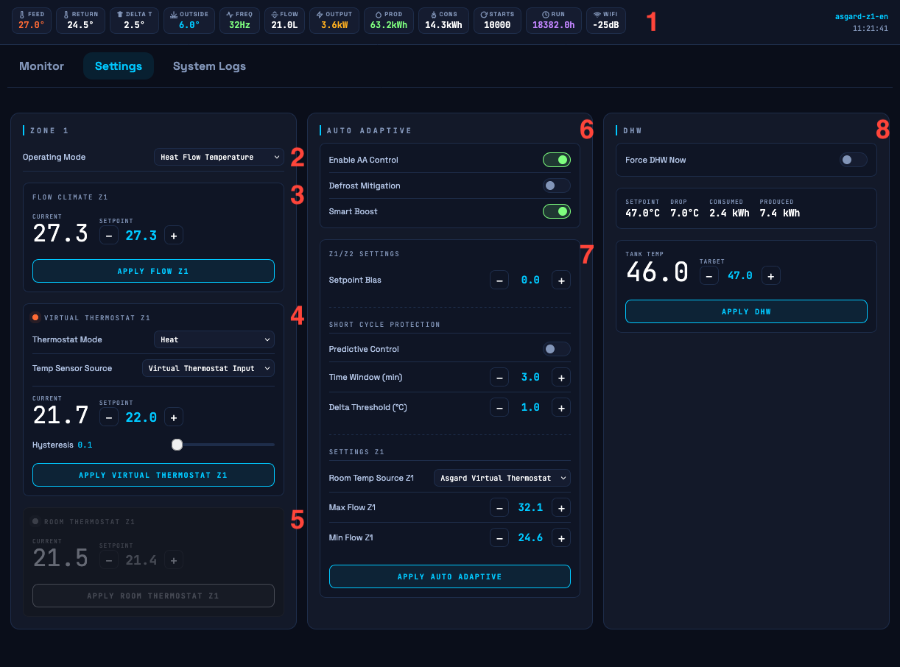

## Standalone Auto Adaptive Installation Guide (Asgard only)

 

### Configure Asgard for Auto Adaptive
1.  Use the `Auto Adaptive: Room Temp Source` selection box to select the room temperature source. `Choose Asgard virtual thermostat`
2.  Use the `Virtual Thermostat: Temp Sensor Source` selection box to select the temperature sensor source for the virtual thermostat. 
    * Virtual Thermostat input: Use this if you have a sensor that is updating via REST API (see section below)
    * Ds18x20: Use this option if you are using the dallas temperature sensors
    * MRC: Use this option if you don't have any external temperature sensors. The temperature sensor is located within the main display. Please beware of the low resolution (0.5c) of this option.
3.  Use the `Operating Mode` selection box to select `Heat Flow Temperature` 
4.  Enable the Auto Adaptive `Enable/Disable` switch to enable the auto adaptive algorithm
5.  Click `APPLY ZONE 1` 
6.  [Optional] For 2 zone systems: Apply Step 1 - 3 


### Configure virtual thermostat temperature sensor via REST API
The esphome component will expose a REST API for the feedback values. You can use GET/POST to access/modify the current temperature. The entities will be named `asgard_vt_input_z1` for zone 1 and `asgard_vt_input_z2` for zone 2. Any temperature sensor that can communicate over REST API can be used.

### Example Get data z1
```bash
curl -X GET "http://ecodan-heatpump.local/number/Virtual%20Thermostat%20Input%20z1"
   
# returns
{"name_id":"number/Virtual Thermostat Input z1","id":"number-virtual_thermostat_input_z1","value":"22.0","state":"22.0 °C"}%
```

### Example Post data z1 (set 21.5c)
```bash
curl -X POST "http://ecodan-heatpump.local/number/Virtual%20Thermostat%20Input%20z1/set?value=21.5" -d ""
```

> [!TIP]
> **Standalone history:** When running in standalone mode, the (graph) data is 'stored' inside your browser (up to 24h). If you want to record events, just leave you browser running. The logging is also automatically collected at the bottom of the page. These logs can be exported via the `download` button.
