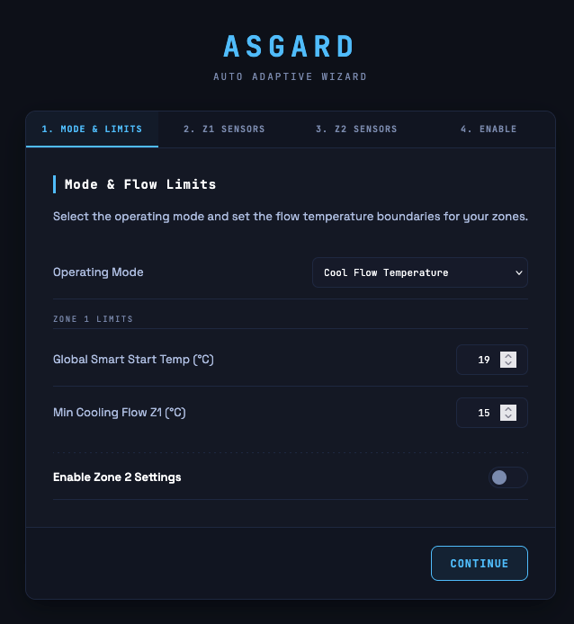
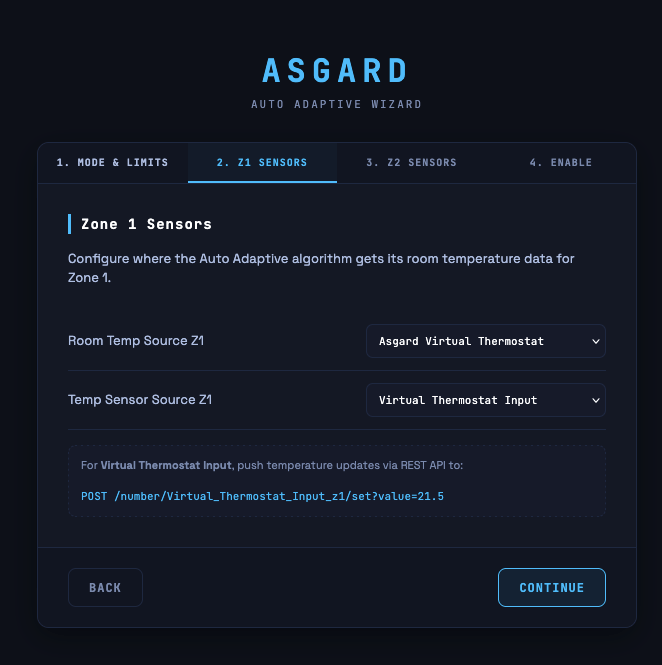
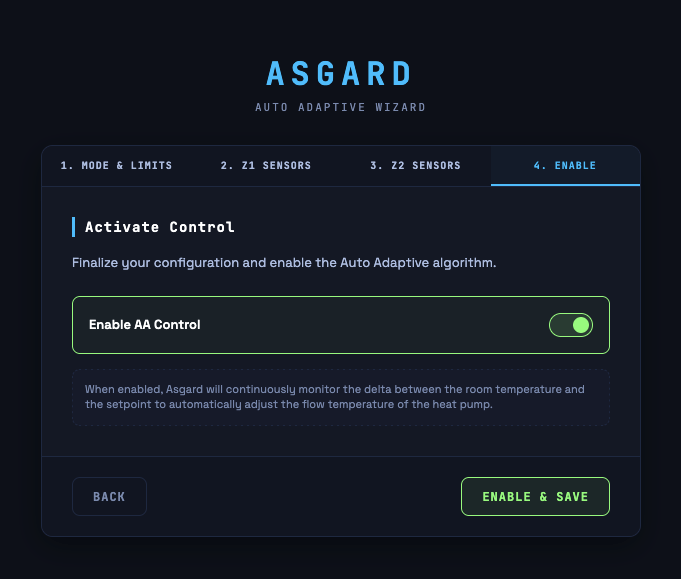

## Configure Auto Adaptive Wizard
Navigate to: `http://ecodan-heatpump.local/dashboard/setup`

### Step 1: Mode & Limits
 

Choose your operating mode and set the safe boundaries for your flow temperatures. The available settings change dynamically based on the selected mode:

| Control | Description |
|---------|-------------|
| **Operating Mode** | Choose `Cool Flow Temperature` for cooling or `Heat Flow Temperature` for heating. |
| **Max / Min Heating Flow** *(Heating)* | The absolute maximum and minimum allowed water flow temperatures for heating mode. |
| **Global Smart Start Temp** *(Cooling)* | The upper-bound return temperature for cooling. The calculated flow temperature will always be clamped between `[Min Cooling Flow]` and `[Smart Start Temp]`. Applies globally to all zones. |
| **Min Cooling Flow** *(Cooling)* | The absolute minimum allowed cooling flow temperature. Set it to a safe limit (e.g., 18°C for floor cooling) to avoid condensation. |
| **Enable Zone 2 Settings** | Toggle this if your system has a secondary heating/cooling circuit. |

### Step 2: Zone 1 Sensors
 

Configure where the Auto Adaptive algorithm gets its room temperature data for Zone 1.

**Room Temp Source options:**

| Option | Description |
|--------|-------------|
| **Room Thermostat** | Choose this option if you are using the Mitsubishi MRC or Wireless thermostat (or CNRF project). |
| **Home Assistant / REST API** | Reads room temperature from a value pushed via REST API or HA sync/blueprint. Use this option when you don't have an Asgard PCB installed or did not wire R1/R2. |
| **Asgard Virtual Thermostat** | Uses the Virtual Thermostat relay (R1/R2) as the control signal and the room temperature source. Requires R1/R2 to be wired. The virtual thermostat's current room temperature is used for AA calculations. |

If you chose the **Asgard Virtual Thermostat**, set the **Temp Sensor Source** to define where the actual temperature data comes from:

| Option | Description |
|--------|-------------|
| **Virtual Thermostat Input** | A sensor feeding temperature via REST API (e.g., pushed from a Home Assistant automation/blueprint, REST API call). |
| **DS18x20 (Dallas)** | A wired DS18B20 sensor physically connected to the One Wire header on the Asgard PCB. |
| **MRC (Main Display)** | The temperature sensor inside the main Mitsubishi display unit. *Warning: Low resolution (0.5°C steps) — use only if no other sensor is available.* |

### Step 3: Activate Control
 

| Control | Description |
|---------|-------------|
| **Enable AA Control** | Toggle this to activate the Auto Adaptive algorithm. When enabled, Asgard will continuously monitor the delta between the room temperature and the setpoint to automatically adjust the flow temperature of the heat pump in the background. |