# ODIN Getting Started Guide

> **ODIN** — Dynamic Cost Optimizer for heat pumps. This guide walks you through first boot, the setup wizard, firmware updates, and a complete description of every setting in the dashboard.

---

## Table of Contents

1. [What You Need](#1-what-you-need)
2. [Known Limitations & Expectations](#2-known-limitations--expectations)
3. [License & Usage Conditions](#3-license--usage-conditions)
4. [First Boot — Wi-Fi Setup](#4-first-boot--wi-fi-setup)
5. [Setup Wizard](#5-setup-wizard)
6. [Navigating the Dashboard](#6-navigating-the-dashboard)
7. [Firmware Updates (OTA)](#7-firmware-updates-ota)
8. [Settings — Location & Energy](#8-settings--location--energy)
9. [Settings — Solver Tuning](#9-settings--solver-tuning)
10. [Settings — 24h Schedule Profile](#10-settings--24h-schedule-profile)
11. [Settings — Energy Constraints](#11-settings--energy-constraints)
12. [Environmental Data Tab](#12-environmental-data-tab)
13. [Monitor Tab](#13-monitor-tab)
14. [Quick-Start Checklist](#14-quick-start-checklist)
15. [Asgard — Solver Tab](#15-asgard--solver-tab)
16. [Monitoring Performance — Room Temperature Charts](#16-monitoring-performance--room-temperature-charts)
17. [How the Optimizer Works](#17-how-the-optimizer-works)
18. [API Data Feeds — Pushing Prices & Weather](#18-api-data-feeds--pushing-prices--weather)
19. [Factory Reset](#19-factory-reset)

---

## 1. What You Need

- **Asgard hardware** with virtual thermostats wired (required — ODIN cannot function without it)
  * Buffer tank systems will have to use the virtual thermostats z1 and/or z2
- **ODIN hardware**
- It is required to run Auto Adaptive, as the solver utilizes it to enforce safety constraints and boundary limits.
- A browser to complete initial setup
- Your location coordinates (latitude / longitude) — the setup wizard has an interactive map
- Basic knowledge of your house: heating system type, solar panel capacity (if any), heat pump rated output

> **Note:** ODIN is a standalone, local device — it requires no cloud subscription or external account. All computation runs on the device itself. It does retrieve time, weather and energy prices from the internet.

---

## 2. Known Limitations & Expectations

While ODIN is highly advanced, it is important to set the right expectations regarding what the system can and cannot do:

- **External API Dependency:** For fully automatic operation, ODIN relies on third-party servers for weather forecasts (e.g., Open-Meteo) and electricity prices (e.g., ENTSO-E). While multiple sources are supported, these external services can change their data structures, experience downtime, or alter their free tiers outside of our control. *Mitigation:* ODIN features built-in manual API endpoints (see [Section 18](#18-api-data-feeds--pushing-prices--weather)). You can push your own data locally (e.g., via Home Assistant), ensuring ODIN will always work regardless of what happens to the public APIs.
- **Solar Forecast Inaccuracy:** Solar production is calculated using weather predictions, which cannot be 100% accurate. Passing clouds, unexpected haze, or partial panel shading can cause the actual yield to be lower than the forecast. *Mitigation:* Use the **Min Solar Coverage (%)** parameter (see [Section 9](#min-solar-coverage-)) to require a safety buffer (e.g., 120%–150%) before ODIN assumes heating is genuinely powered by free solar.
- **Human Factors & Unpredictable Heat Gains:** The solver learns your house's thermal behavior over time, but it cannot predict human actions. Opening windows for an hour, lighting a fireplace, cooking a large meal, or hosting a party will alter the room temperature in ways the model could not anticipate. ODIN will notice the deviation and adjust the plan for the *next* hour.
- **Hardware Overrides:** ODIN optimizes the schedule, but it cannot override the heat pump's physical safety limits or hard-coded triggers. For instance, if someone takes a very long shower and the tank temperature hits the physical drop point, the heat pump will start immediately to recover the tank, regardless of ODIN's cost plan.
- **FTC5 / FTC4 (firmware > 12.01):** FTC5 and FTC4 do not provide 'real-time' energy consumption numbers. Asgard will use the daily reported consumption as a fallback. Please be advised that the energy consumption bar per hour will not display a value. It is recommended to install **an** energy meter and **link it** in Asgard. Then you will be able to see the hourly energy consumption.
- **High Resolution Temperature Sensor:** It is recommended to use a temperature sensor with a **0.1°C** resolution. ODIN will be able to observe temperature changes faster and react accordingly.
- **Legionella Prevention:** Odin has no control over Legionella Prevention.

---

## 3. License, Usage Conditions & Warranty

ODIN is provided under a strict home-use agreement. By using the ODIN software and hardware, you agree to the following terms and conditions:

- **Personal / Home Use Only:** The system is intended strictly for private, residential use to optimize personal energy consumption.
- **No Commercial Use:** You may not use ODIN for any commercial purposes. This includes, but is not limited to, managing commercial properties, industrial applications, charging clients for optimization services, or reselling the hardware/software package as part of a commercial installation service.
- **Disclaimer of Liability:** The creators of ODIN are not responsible for any damages to your property, heating system, or home caused by using this software. Users are required to actively monitor the system to ensure it is behaving correctly and safely. Please be extra vigilant **especially when cooling**, as improper cooling operation can lead to severe condensation and water damage.
- **Limited Warranty:** A **1-year warranty** is provided against **hardware** manufacturing defects.
    * **Exclusions:** The warranty is **VOID** if failure is caused by user error, such as:
    * Physical modification or soldering by the user.
    * Water damage
    * **Accidental damage (e.g. dropping the unit, cracking the 3D printed casing).**

---

> [!TIP]
> **Optimal Placement:** To ensure a stable connection, place your Odin unit near a Wi-Fi access point or router. Due to its low power consumption, Odin can be conveniently powered directly from a spare USB port on your router or NAS.

> [!IMPORTANT]
> **Assign a Static IP Address:** For optimal reliability, please configure a static (fixed) IP address for your Odin unit. You can typically do this in your router's settings by creating a DHCP reservation using Odin's MAC address.

## 4. First Boot — Wi-Fi Setup

When ODIN boots for the first time (or after a Wi-Fi reset), it cannot connect to your home network yet. It creates its own temporary access point so you can configure it.

### Step 1 — Connect to the ODIN access point

On your phone or laptop, open Wi-Fi settings and look for a network named:

```
ODIN_Setup
```

Connect to it. No password is required.

### Step 2 — Open the setup wizard

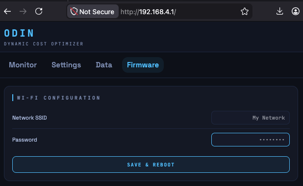 

Open a browser and go to:

[http://192.168.4.1](http://192.168.4.1)

Open the **Setup Wizard** (see [Section 5](#5-setup-wizard)). Complete all five steps to configure pricing, location, solar, weather, and heat pump parameters before ODIN connects to your home network.

### Step 3 — Find ODIN on your network

After the wizard saves and reboots ODIN, it connects to your home network. The access point disappears. ODIN is then accessible via its local IP address. You can find this in your router's connected devices list, or try:

```
ping odin.local
```

> **Tip:** Assign a static IP to ODIN in your router settings so the address never changes.

---

## 5. Setup Wizard

The setup wizard is a guided 5-step process that runs on first boot (or can be re-opened by navigating to `http://<odin-ip>/setup`). It collects the minimum configuration needed before ODIN can start optimizing.

The wizard pre-fills any values already stored in ODIN's configuration, so re-running it is safe and non-destructive.

### Step 1 — Pricing Configuration

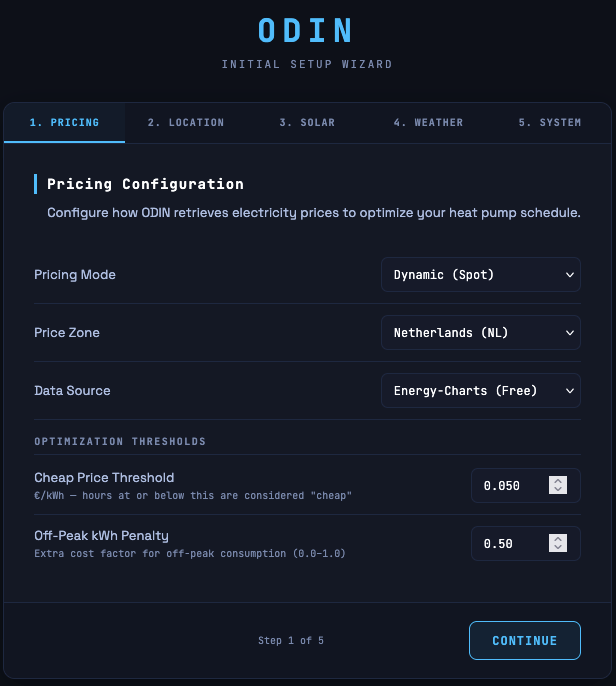 

Configure how ODIN retrieves electricity prices.

| Field | Description |
|-------|-------------|
| **Pricing Mode** | `Dynamic (Spot)` uses hourly day-ahead market prices. `Fixed Rate` uses a flat price you enter manually. |
| **Price Zone** | Your electricity market region (see the full zone list in [Section 8](#price-zone)). |
| **Data Source** | `Energy-Charts (Free)` requires no account. `ENTSO-E (Requires Token)` uses the official European exchange data and requires a free API token. `External API (HTTP POST)` disables automatic fetching — prices are pushed to ODIN from an external system (see [Section 18](#18-api-data-feeds--pushing-prices--weather)). |
| **ENTSO-E API Token** | Only shown when ENTSO-E is selected. Format: `xxxxxxxx-xxxx-xxxx-xxxx-xxxxxxxxxxxx`. Get one free at [transparency.entsoe.eu](https://transparency.entsoe.eu). |

### Step 2 — Geographical Location

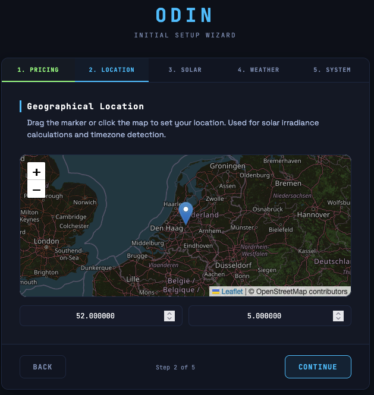 

An interactive map allows you to drag a marker or click to set your location. ODIN uses this to fetch the correct weather forecast and solar irradiance for your area.

The latitude and longitude fields below the map update automatically as you move the marker. Six decimal places of precision are stored.

> **Why this matters:** An incorrect location gives wrong solar irradiance data, which causes ODIN to over- or under-estimate how much of the heat pump's load your panels are covering.

### Step 3 — Solar PV System

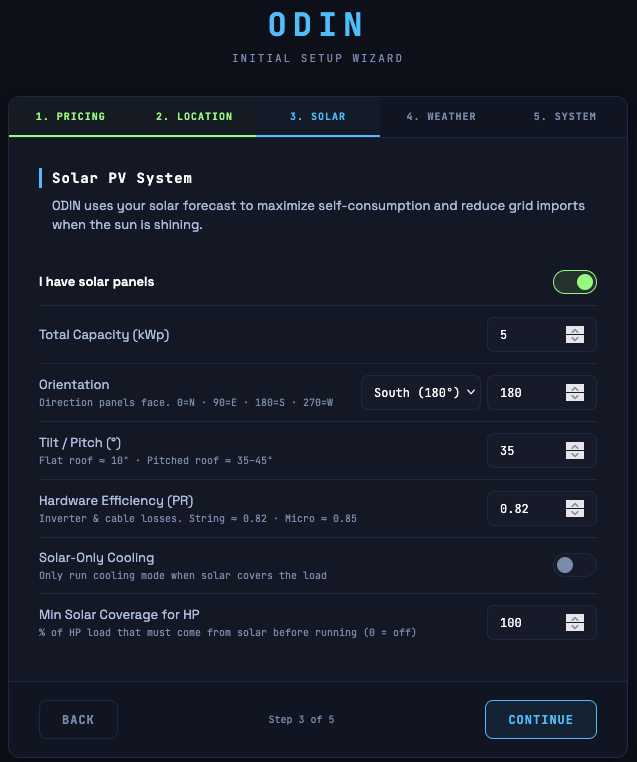 

Toggle **I have solar panels** on if you have a PV installation. The fields below become active:

| Field | Description |
|-------|-------------|
| **Total Capacity (kWp)** | The peak output of your installation in kilowatts-peak. |
| **Orientation (Degrees)** | The compass direction your panels face, in degrees (0 = North, 90 = East, 180 = South, 270 = West). Use the preset dropdown or enter exact degrees. |
| **Tilt / Pitch (Degrees)** | The angle your panels are mounted at. Flat roof = ~10°, pitched roof = ~35–45°. |

You can define multiple arrays by pressing the `add array` button.

If you have no solar panels, leave the toggle off. ODIN will still optimize around price. Please be advised that solar production is an **estimation** based on the parameters.

### Step 4 — Weather Data Source

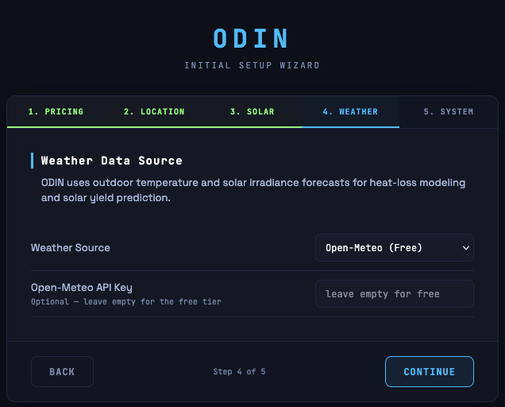 

ODIN uses outdoor temperature and solar irradiance forecasts for heat-loss modeling and solar yield prediction.

| Field | Description |
|-------|-------------|
| **Weather Source** | `Open-Meteo (Free)` requires no key for the free tier. `Visual Crossing` requires a free API key. `Manual API (HTTP POST)` disables automatic fetching — weather data must be pushed to ODIN from an external system. |
| **Open-Meteo API Key** | Optional — leave empty for the free tier. |
| **Visual Crossing API Key** | Required when Visual Crossing is selected. Get one free at [visualcrossing.com](https://www.visualcrossing.com). |

### Step 5 — Heat Pump Specifications

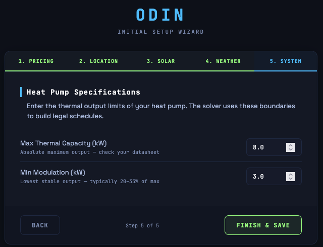 

Enter the thermal limits of your heat pump so the solver can plan realistic loads:

| Field | Description |
|-------|-------------|
| **Max Thermal Capacity (kW)** | The maximum heat output your heat pump can deliver at typical outdoor temperatures. Check the technical datasheet for the value at 7°C. |
| **Min Modulation (kW)** | The lowest output your heat pump can sustain before the compressor shuts off. Below this level, the HP cycles on/off instead of modulating smoothly. |

Click **Finish & Save** on step 5. ODIN saves all settings and redirects to the main dashboard.

---

## 6. Navigating the Dashboard

The dashboard has four tabs at the top:

| Tab | Purpose |
|-----|---------|
| **Monitor** | Live system status, optimization logs, debug output |
| **Settings** | All configuration parameters |
| **Data** | Today's electricity prices and weather forecast |
| **Firmware** | Wi-Fi configuration and OTA firmware updates |

The firmware version is shown in the top-left corner of the header. A connection indicator shows whether ODIN is reachable.

---

## 7. Firmware Updates (OTA)

ODIN supports over-the-air (OTA) firmware updates directly from the dashboard.

### How to update

1. Download the latest `.bin` firmware file from the ODIN releases page
2. Open the ODIN dashboard and go to the **Firmware** tab
3. Scroll to **Firmware Update (OTA)**
4. Click **Select .BIN** and choose the downloaded file
5. Click **Upload & Flash**
6. Wait — the upload takes 20–60 seconds depending on file size
7. ODIN will automatically reboot into the new firmware

> ⚠️ **Do not power off the device during the update.**

---

## 8. Settings — Location & Energy

Open the **Settings** tab. This section is divided into sub-sections: **Pricing**, **Weather**, **Location**, and **Solar PV**. Click **Apply Location & Energy** to save all changes in this section at once.

---

### Pricing Mode

**What it does:** Chooses whether ODIN uses real-time hourly spot prices or a fixed flat rate.

| Option | When to use |
|--------|------------|
| **Dynamic (Spot)** | You have a dynamic electricity contract where the price changes every hour. ODIN fetches today's prices automatically and plans heating around the cheapest hours. |
| **Fixed Rate** | You pay a flat rate per kWh. ODIN still optimises around comfort and solar, but all hours are treated as equal cost. |

---

### Fixed Price (€/kWh)

*Only shown when Pricing Mode is set to Fixed Rate.*

The flat electricity price you pay per kWh, e.g. `0.280` for €0.28/kWh.

---

### Price Zone

Selects your electricity market zone, which determines which day-ahead market data is fetched and which energy tax and VAT rates apply. All prices shown in the dashboard are **all-in consumer prices** — spot price plus applicable energy tax plus VAT — calculated using the rates for the selected zone.

#### Benelux

| Zone | Country / Region | Energy Tax | VAT |
|------|-----------------|-----------|-----|
| `NL` | Netherlands | EB + ODE (€0.109/kWh) | 21% |
| `BE` | Belgium | Excise duty (€0.050/kWh) | 6% |

#### Germany / Austria / Switzerland

| Zone | Country / Region | Energy Tax | VAT |
|------|-----------------|-----------|-----|
| `DE-LU` | Germany & Luxembourg | Stromsteuer (€0.041/kWh) | 19% |
| `DE-AT-LU` | Germany / Austria / Luxembourg (legacy zone) | Stromsteuer (€0.041/kWh) | 19% |
| `AT` | Austria | Elektrizitätsabgabe (€0.015/kWh) | 20% |
| `CH` | Switzerland | None | 8.1% |

#### France & Iberia

| Zone | Country / Region | Energy Tax | VAT |
|------|-----------------|-----------|-----|
| `FR` | France | TICFE (€0.033/kWh) | 20% |
| `ES` | Spain | Impuesto electricidad (€0.005/kWh) | 21% |
| `PT` | Portugal | Imposto especial consumo (€0.001/kWh) | 23% |

#### British Isles

| Zone | Country / Region | Energy Tax | VAT |
|------|-----------------|-----------|-----|
| `GB` | Great Britain | None | 5% |
| `IE` | Ireland | Electricity tax (€0.001/kWh) | 9% |

#### Scandinavia & Finland

| Zone | Country / Region | Energy Tax | VAT |
|------|-----------------|-----------|-----|
| `DK1` | Denmark (West) | Elafgift (€0.100/kWh) | 25% |
| `DK2` | Denmark (East) | Elafgift (€0.100/kWh) | 25% |
| `FI` | Finland | Sähkövero Class I (€0.023/kWh) | 25.5% |
| `SE1` | Sweden (North) | — (via grid operator) | 25% |
| `SE2` | Sweden (North-Central) | — (via grid operator) | 25% |
| `SE3` | Sweden (South-Central) | — (via grid operator) | 25% |
| `SE4` | Sweden (South) | — (via grid operator) | 25% |
| `NO1` | Norway (East) | — (via grid operator) | 25% |
| `NO2` | Norway (South-West) | — (via grid operator) | 25% |
| `NO3` | Norway (Central) | — (via grid operator) | 25% |
| `NO4` | Norway (North) | — (via grid operator) | 25% |
| `NO5` | Norway (West) | — (via grid operator) | 25% |

> **Note for Scandinavia:** Norway and Sweden levy their electricity tax through the grid operator's bill, not on the spot price itself. Adding it at the spot level would cause double-counting for users who already see it on their grid invoice. VAT is still applied.

#### Eastern Europe

| Zone | Country / Region | Energy Tax | VAT |
|------|-----------------|-----------|-----|
| `PL` | Poland | Akcyza (€0.010/kWh) | 23% |
| `CZ` | Czech Republic | Spotřební daň (€0.028/kWh) | 21% |
| `SK` | Slovakia | Spotrebná daň (€0.013/kWh) | 20% |
| `HU` | Hungary | Villamosenergia-adó (€0.001/kWh) | 27% |
| `RO` | Romania | Acciză (€0.003/kWh) | 19% |
| `BG` | Bulgaria | Акциз (€0.002/kWh) | 20% |
| `SI` | Slovenia | Trošarina (€0.015/kWh) | 22% |
| `HR` | Croatia | Trošarina (€0.005/kWh) | 25% |
| `EE` | Estonia | Aktsiis (€0.005/kWh) | 22% |
| `LT` | Lithuania | Akcizas (€0.001/kWh) | 21% |
| `LV` | Latvia | Akcīze (€0.001/kWh) | 21% |
| `GR` | Greece | Special consumption tax (€0.003/kWh) | 24% |
| `RS` | Serbia | None (non-EU) | 20% |

#### Italy

| Zone | Country / Region | Energy Tax | VAT |
|------|-----------------|-----------|-----|
| `IT-NORTH` | Italy (Macrozone North) | Accisa (€0.023/kWh) | 10% |

If your zone is not listed, choose the closest market zone or use **Fixed Rate** mode to bypass spot price fetching entirely.

---

### Price Source

| Option | Description |
|--------|-------------|
| **Energy-Charts (default)** | Free, no account needed. Covers all supported European zones. Recommended for most users. |
| **ENTSO-E Transparency** | Official European energy exchange data. Requires a free API token. More reliable in some zones. Falls back to Energy-Charts if the fetch fails. |
| **External API (HTTP POST)** | Disables all automatic price fetching. Prices must be pushed to ODIN by an external system (e.g. Home Assistant, a script, or a custom integration). See [Section 18](#18-api-data-feeds--pushing-prices--weather) for the endpoint and payload format. |

---

### ENTSO-E Token

*Only shown when Price Source is set to ENTSO-E.*

Your personal API token from the ENTSO-E Transparency Platform. Register for free at [transparency.entsoe.eu](https://transparency.entsoe.eu) and request a Web API security token in your account settings.

**Format:** `xxxxxxxx-xxxx-xxxx-xxxx-xxxxxxxxxxxx`

---

### Weather Source

**What it does:** Selects which provider ODIN uses for weather forecasts and solar irradiance data. Both automatic sources cover all supported European and British zones.

| Option | Notes |
|--------|-------|
| **Open-Meteo (default)** | Free, no account or key needed. Good accuracy across Europe. Uses server-side tilted-plane irradiance (POA) calculation — more accurate than post-processing for non-south orientations. |
| **Visual Crossing** | Alternative provider. Requires a free API key from [visualcrossing.com](https://www.visualcrossing.com). Irradiance is transposed from GHI to POA using ODIN's built-in model. Some users find it more accurate for their specific location. |
| **Manual API (HTTP POST)** | Disables all automatic weather fetching. Temperature and solar irradiance must be pushed to ODIN by an external system (e.g. Home Assistant, a local weather station, or a custom integration). See [Section 18](#18-api-data-feeds--pushing-prices--weather) for the endpoint and payload format. |

---

### Open-Meteo Key / Visual Crossing Key

These fields appear when the corresponding weather source is selected. Leave **Open-Meteo Key** empty to use the free tier. **Visual Crossing Key** is always required when that source is active. Both fields are hidden when **Manual API** mode is selected — no key is needed since ODIN does not make any outbound weather requests in that mode.

---

### Latitude / Longitude

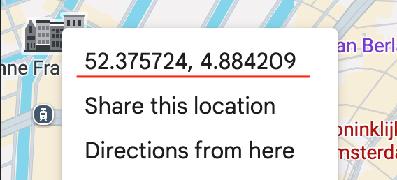

Your geographic coordinates in decimal degrees. Essential for solar irradiance and weather forecasts.

**How to find them:** Search your address on [maps.google.com](https://maps.google.com), right-click your location, and the coordinates appear at the top of the context menu.

**Examples:** `52.3702`, `4.8952` for Amsterdam.

> **Tip:** Use the Setup Wizard's interactive map for easy coordinate entry — just drag the pin to your house.

---

### Solar Capacity (kWp)

The peak output of your solar PV installation in kilowatts-peak. ODIN uses this together with the irradiance forecast to estimate hour-by-hour solar production.

During hours when your panels produce more electricity than the heat pump needs, the effective electricity cost drops to near zero — ODIN will prefer to run the heat pump during these hours.

**If you have no solar panels:** enter `0`.

| System | kWp |
|--------|-----|
| Small (6 panels) | 2.5 |
| Medium (12 panels) | 4.5 |
| Large (25 panels) | 10.0 |
| Very large (28 panels) | 11.0 |

---

### Solar Orientation (Degrees)

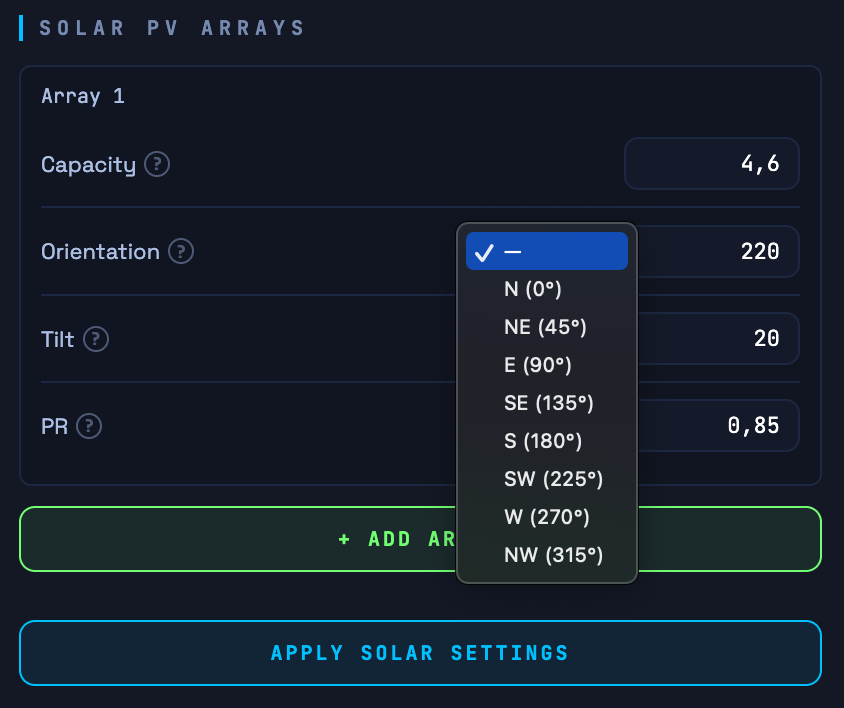

The compass direction your panels face, expressed in degrees (0 = North, 90 = East, 180 = South, 270 = West). Use the preset dropdown for standard directions or enter exact degrees for split arrays.

South-facing (180°) gives the highest midday output. East/West-facing panels shift output toward morning or afternoon.

---

### Solar Tilt / Pitch (Degrees)

The mounting angle of your panels measured from horizontal.

| Installation | Typical tilt |
|-------------|-------------|
| Flat / low-slope roof | 10–15° |
| Standard pitched roof | 30–45° |
| Optimal for NL/BE latitude | ~35° |

ODIN uses the tilt angle together with orientation and irradiance data to calculate accurate hourly production estimates.

---

### Hardware Efficiency (PR)

**Performance Ratio** — accounts for real-world losses: inverter efficiency, cable losses, shading, soiling, and temperature derating. This is a multiplier applied to the theoretical output from your panels.

| Inverter type | Typical PR |
|---------------|-----------|
| String inverter | 0.82 |
| Micro-inverter | 0.85 |
| Central inverter (large systems) | 0.78–0.80 |

**Default:** `0.82`. Only change this if you know your system's measured performance ratio from inverter monitoring data.

---

## 9. Settings — Solver Tuning

These parameters control how ODIN's optimisation engine balances cost savings against comfort. Click **Apply Tuning Params** to save changes.

---

### HP Max Capacity (kW Thermal)

The absolute maximum thermal output your heat pump can deliver. The solver will never plan heat input above this value.

**How to set it:** Use the rated output at the typical outdoor temperature from your heat pump's datasheet.

| HP nameplate | Typical max output |
|--------------|-------------------|
| 5–7 kW | 6.0–7.0 kW |
| 9–12 kW | 8.0–11.0 kW |
| 14–16 kW | 12.0–15.0 kW |

> **Tip — using Max Capacity as a soft cap:** Setting this lower than your heat pump's physical maximum intentionally limits how hard it runs. For example, setting 7 kW on a 10 kW heat pump means ODIN will never plan more than 7 kW of heat per hour. This is useful for reducing noise at night or spreading peak electricity load.

---

### HP Min Modulation (kW Thermal)

The lowest thermal output your heat pump can sustain before the compressor shuts off entirely. Below this level, the heat pump cycles on and off rather than modulating continuously.

**Why it matters:** The solver uses this as a dead zone — it will never plan output between 0 and this value. This avoids short-cycling the compressor, which wastes energy and causes wear.

**How to set it:** Check your heat pump's technical datasheet for the minimum modulation or minimum capacity figure.

| HP model type | Typical min modulation |
|--------------|----------------------|
| Small modulating (5–7 kW) | 1.5–2.5 kW |
| Medium (9–12 kW) | 2.0–3.5 kW |
| Large (14–16 kW) | 3.0–5.0 kW |

---

### "Cheap" Energy Threshold (€/kWh)

Any hour with a spot price below this threshold is treated as a "cheap" hour. During cheap hours, ODIN applies a very low comfort penalty for running above the target temperature — effectively encouraging pre-heating or aggressive DHW heating whenever prices are very low, even if solar is not available.

**Unit:** €/kWh (not €/MWh). Enter the full consumer price including tax for best results.

| Market / contract | Suggested threshold |
|-------------------|---------------------|
| NL dynamic, typical spread | `0.06` |
| BE / DE with cheap night tariff | `0.05` |
| Area with frequent negative prices | `0.02` |

**Default:** `0.04`

---

### Min Solar Coverage (%)

The minimum fraction of the heat pump's electricity load that must be covered by solar before ODIN allows low-penalty pre-heating during mid-priced hours. This prevents the heat pump from running at moderate prices just because it "might" be somewhat solar-assisted.

**Unit:** Percentage, 0–200%.

| Setting | Meaning |
|---------|---------|
| `0%` | Solar coverage is ignored. Pre-heating is driven by price only. |
| `50%` | At least 50% of the HP electricity must come from solar before this hour is treated as "cheap". |
| `100%` | Solar must fully cover the HP before the low penalty applies. |
| `150%` | Solar must be producing 1.5× the HP's estimated draw. Acts as a safety margin for solar forecast inaccuracy — if your irradiance estimates tend to run optimistic, raising this value ensures ODIN only treats an hour as solar-free when panels are genuinely well ahead of demand. |

**Values above 100% are intentionally useful.** Solar irradiance forecasts are estimates, and actual output varies with haze, partial cloud, and panel soiling. Setting 120–150% builds in a buffer so that borderline hours — where the forecast says "just covered" — are not treated as free solar hours when they may not be in practice.

**Recommended starting values:**

| Setup | Value |
|-------|-------|
| Large panels, confident in forecast accuracy | 50–75% |
| Typical setup, standard panels | 100% |
| Forecast tends to be optimistic, or partial shading | 120–150% |

---

### kWh Penalty (Cost Bias)

Controls how aggressively ODIN pre-heats during cheap hours versus keeping the house close to the target temperature at all times. This is the most important single tuning parameter.

Think of it as a slider between "maximum savings" and "maximum comfort stability."

| Value | Behaviour |
|-------|-----------|
| `0.1` | Very aggressive. Large temperature swings. Maximum cost savings. |
| `0.3` | Recommended for well-insulated or passive houses with UFH. |
| `0.5` | Balanced. Good starting point for most houses. |
| `1.0` | Conservative. Pre-heats only when price difference is large. |
| `2.0` | Minimal optimisation. House stays close to target at all times. |

| House type | Recommended starting value |
|------------|---------------------------|
| Passive / near-passive, UFH, high thermal mass | 0.3 |
| Modern well-insulated, UFH | 0.5 |
| Average house, radiators | 0.7 |
| Older draughty house | 1.0 |

> **Tip:** Start at `0.5`. Reduce toward `0.3` if your house holds temperature well and you want bigger savings. Increase toward `1.0` if temperature swings feel uncomfortable.

---

### Solar-Only Cooling (toggle)

**What it does:** When this toggle is **on**, ODIN will only plan active cooling during hours when solar production covers at least the minimum solar coverage percentage of the heat pump's electricity consumption. During hours with insufficient solar, cooling is blocked even if the house is above the comfort maximum.

**When to use it:** Enable this if you want cooling to be completely free-of-charge (solar-only) and are comfortable with the house running slightly warm during cloudy spells. This is especially effective in summer when solar and cooling demand overlap naturally.

**When to leave it off:** If you also want cooling during evenings or overcast periods (where grid electricity is used), leave this off and rely on the standard price-based optimisation instead.

> This setting only affects cooling mode. Heating operation is unaffected.

---

## 10. Settings — 24h Schedule Profile

The schedule defines your **comfort temperature band** for each hour of the day. ODIN will never plan to heat above the maximum or let the house cool below the minimum.

### How the schedule works

The schedule is divided into **time blocks**. Each block defines settings that apply from its start hour until the next block begins. The last block wraps around to midnight.

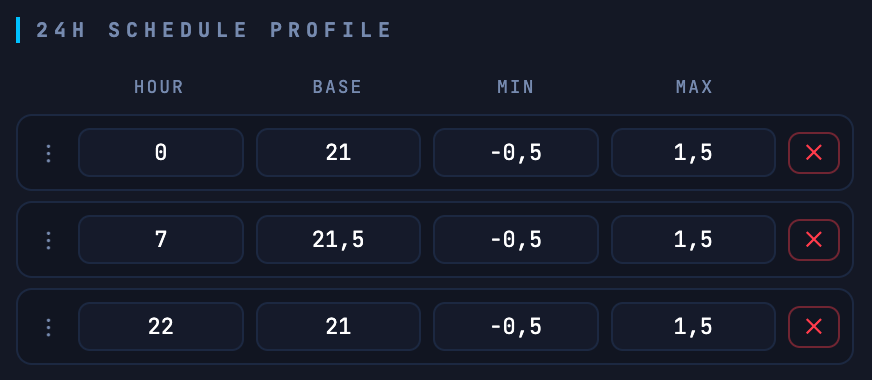

Each block has four fields:

| Field | Description |
|-------|-------------|
| **Hour** | The hour (0–23) at which this block starts |
| **Base** | Your target ("setpoint") temperature in °C |
| **Min** | Offset below Base that is still acceptable (e.g. `-0.5` means the house can be 0.5°C below Base) |
| **Max** | Offset above Base that is still acceptable (e.g. `+1.5` means the house can be 1.5°C above Base) |

The resulting comfort band is `[Base + Min, Base + Max]`. ODIN plans heating to stay within this band at all times, shifting load to cheaper or solar hours where the band allows.

### Example schedule

| Hour | Base | Min | Max | Meaning |
|------|------|-----|-----|---------| 
| 0 | 21.0 | −0.5 | +1.5 | Night: 20.5–22.5°C acceptable |
| 7 | 21.5 | −0.5 | +1.5 | Morning: 21.0–23.0°C acceptable |
| 9 | 22.0 | −0.5 | +1.5 | Day: 21.5–23.5°C acceptable |
| 22 | 21.0 | −0.5 | +1.5 | Evening wind-down |

### Tips for setting the schedule

- **Wide bands give ODIN more freedom** to shift heating to cheap/solar hours. A ±1.5°C band is a good starting point.
- **UFH systems** can tolerate wider bands because the floor stores heat. Try Base ± 1.5°C.
- **Radiator systems** react faster and may prefer tighter bands: Base ± 0.5°C.
- **Night setback:** lower the Base by 0.5–1.0°C during sleeping hours if comfort allows. ODIN will plan accordingly.
- **Avoid setting Min = 0** (same as Base). This prevents ODIN from ever letting the house drift slightly cool during expensive hours, which reduces savings potential.

### Managing blocks

- Click **+ Add Time Block** to add a new block
- Edit any field directly in the row
- Drag the **⋮** handle to reorder blocks
- Click **✕** to remove a block
- Click **Compile & Send** to save all changes

---

## 11. Settings — Energy Constraints

The **Energy Constraints** section lets you set a per-hour cap on either the heat pump's electrical consumption or its thermal output. This is separate from the comfort schedule — where the schedule defines what temperature to maintain, constraints define how hard the heat pump is allowed to work to get there.

### Constraint Mode

Select one of three modes:

| Mode | Description |
|------|-------------|
| **Disabled** | No constraint is applied. The solver uses HP Max Capacity as the only ceiling. |
| **Max Consumption** | Caps the heat pump's electrical draw (kW) per hour. Useful for homes with a limited grid connection or a smart meter limit. |
| **Max Output** | Caps the heat pump's thermal output (kW) per hour. Useful for "silent mode" scheduling — preventing the heat pump from running at high output during night hours. |

### Constraint Schedule

When a mode other than Disabled is selected, a time-block schedule appears — identical in structure to the comfort schedule. Each block sets a start hour and a maximum value (in kW) for that period.


**Example — Silent Mode (Max Output):**

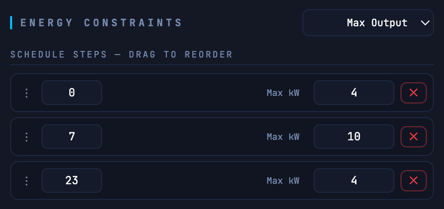


This limits the heat pump to 4 kW thermal output between 23:00 and 07:00 (quiet at night), while allowing full output during the day.

**Example — Grid Limit (Max Consumption):**

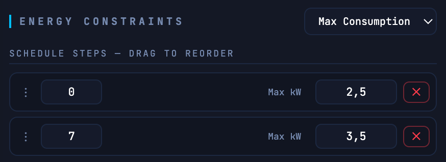


This prevents the heat pump from drawing more than the specified electrical power, for instance to stay within a smart meter capacity tariff limit.

Click **Compile & Send Limits** to save the constraint schedule.

> **Note:** Constraints are enforced as hard limits — the solver will never produce a plan that exceeds the limit for a given hour. If the constraint is tighter than what is needed to maintain comfort, ODIN will simply plan less heating for that hour, which may cause the house temperature to drift toward (but not below) the schedule minimum.

---

## 12. Environmental Data Tab

The **Data** tab shows the current inputs ODIN is working with:

Both charts display **48 hours** of data: today's 24 hours followed by tomorrow's 24 hours (labelled `+1d 0:00` through `+1d 23:00`). This gives you a full view of the data ODIN is working with for today and the complete plan it has already built for tomorrow night.

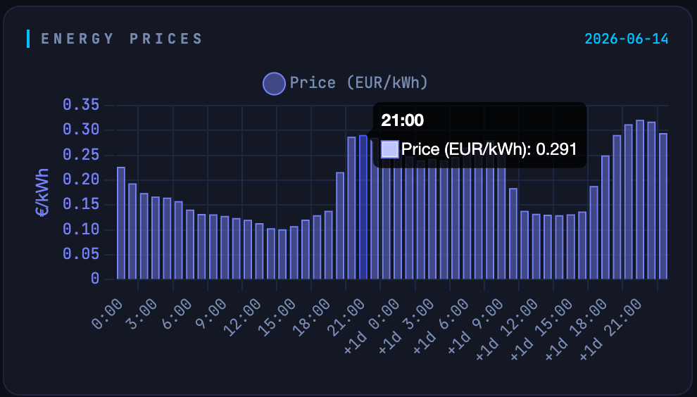

**Energy Prices** — hourly day-ahead spot prices in EUR/kWh, shown as a bar chart. The date the prices apply to is shown below the chart title. Tomorrow's prices appear in the `+1d` portion of the chart once they have been fetched (typically available from around 13:00 CET). If prices show `0` for all hours, click **Fetch Latest Data** to manually trigger a refresh.

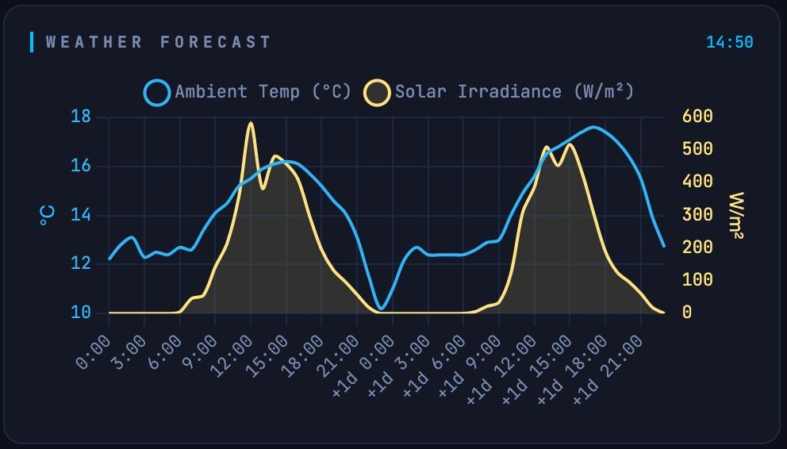

**Weather Forecast** — hourly outside temperature (°C) and solar irradiance (W/m²) for your location across both days. The timestamp of the last weather fetch is shown below the title.

### Reading the 48-hour view

The split between today and tomorrow is the key thing to look for:

- **Today's hours (0:00–23:00):** prices and weather that are currently being used for active optimisation
- **Tomorrow's hours (+1d 0:00 – +1d 23:00):** prices and weather already fetched for overnight planning. ODIN builds tomorrow's heating plan before midnight, so it needs this data in advance.

If tomorrow's prices are missing (all zero in the `+1d` section), it usually means they haven't been published yet by the exchange. Day-ahead prices for the following day are normally published by 13:00 CET. ODIN fetches them automatically at 23:30 each night; you can also trigger an early fetch manually.

### Manual refresh

Click **Fetch Latest Data** at the top right to immediately refresh both prices and weather for both days. This is useful after changing your location or weather source in Settings — always verify here that the correct data loads before relying on it for overnight planning.

---

## 13. Monitor Tab

The **Monitor** tab shows live system status:

| Field | Description |
|-------|-------------|
| **Uptime** | How long ODIN has been running since last reboot |
| **Free Heap** | Available memory on the ESP32. Healthy values are above 100 KB. |
| **DP Runs** | Number of optimisation solves completed since boot |
| **Last Speed** | How long the last solve took in milliseconds. Typically 20–100 ms. |
| **Last Optimization** | Result of the most recent solve attempt |

**System Logs** shows a live scrolling log of ODIN's activity. Use **Debug JSON** to download the last request and response payload — useful for troubleshooting. Use **Clear** to reset the log buffer. **Pause** freezes the log display without stopping logging; click **Resume** to continue.

---

## 14. Quick-Start Checklist

Use this checklist after first-time setup to confirm everything is configured correctly:

- [ ] ODIN is connected to your home Wi-Fi (dashboard loads via local IP)
- [ ] Setup Wizard completed — or all five setting areas manually configured
- [ ] **Latitude** and **Longitude** are set to your location
- [ ] **Price Zone** matches your country
- [ ] **Pricing Mode** is set to Dynamic (if you have a dynamic contract)
- [ ] **Solar Capacity** is set (or `0` if no panels)
- [ ] **Solar Orientation**, **Tilt**, and **Hardware Efficiency** match your installation
- [ ] **HP Max Capacity** and **HP Min Modulation** match your heat pump's datasheet
- [ ] **kWh Penalty** is set (start with `0.5`)
- [ ] **24h Schedule** has at least one block with sensible temperature targets
- [ ] Go to the **Data** tab and click **Fetch Latest Data** — verify prices and weather load correctly
- [ ] Go to the **Monitor** tab — after a minute, **Last Optimization** should show a successful solve

---

## 15. Asgard — Solver Tab

The **Solver** tab in the Asgard dashboard is where you connect Asgard to ODIN, monitor the optimisation results, and fine-tune the physics parameters that the solver uses to model your house.

> **To show the Solver tab:** go to **Settings → ADVANCED CONTROL → Odin Solver** and enable **Show Solver Tab**. The tab will appear in the navigation bar.

---

### 15.1 Connecting to ODIN

#### Automatic detection

Asgard automatically tries to find ODIN on your local network using mDNS. If ODIN is reachable at `odin.local`, Asgard resolves the IP address and connects without any manual configuration. When the connection is established, the **Connection Status** field turns green and shows **ONLINE**.

This check runs automatically every 60 seconds. If ODIN is on the same Wi-Fi network as Asgard, no further action is needed.

#### Manual IP entry (Recommended, much faster than mDNS)


If mDNS does not work on your network (some routers block it), enter ODIN's IP address manually:

1. Find ODIN's IP address in your router's connected devices list
2. Go to the **Solver** tab
3. Enter the IP address in the **Odin IP Address** field (e.g. `192.168.1.42`)
4. Click **Save IP**

Once a valid IP is stored, the **Open ODIN** button appears — click it to open the ODIN dashboard directly in a new tab.

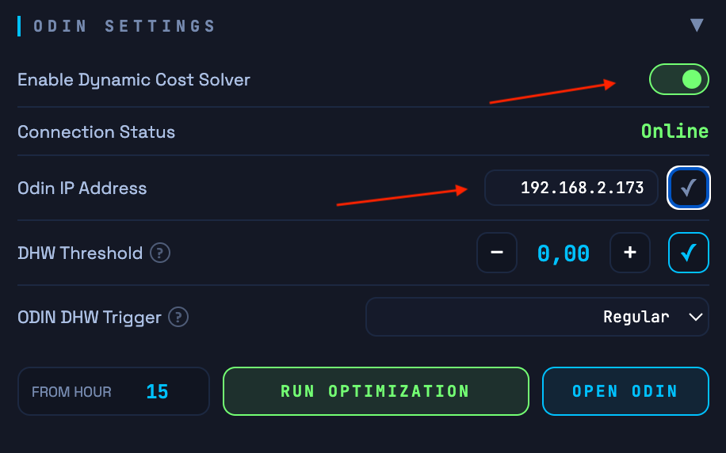

#### Enable Dynamic Cost Solver

Toggle **Enable Dynamic Cost Solver** to activate ODIN-driven heating or cooling control. When enabled, Asgard fetches a new optimisation plan from ODIN every hour and uses it to control the heat pump relay. When disabled, normal thermostat control applies.

---

### 15.2 Running an Optimisation Manually

The **Run Optimization** button triggers an immediate solve to let you preview how setting changes affect the plan. *Note that this is a preview only and will be reset on next refresh.* **From hour** field (next to the button): by default, the solve starts from the current hour. You can override this to test what the solver would plan from a different starting hour (0–23). Leave it blank to use the current hour.

---

### 15.3 Odin Settings

This section houses extra parameters specific to how the ODIN solver behaves:

* **DHW Threshold:** If the DHW temperature drops below `(Target - Drop) + Threshold`, ODIN will try to schedule DHW during an upcoming cheap or sunny hour. Setting this to 0 disables ODIN DHW scheduling.
* **ODIN DHW Trigger:** The method used when ODIN schedules DHW. `Regular` temporarily bumps the DHW target by max drop + 1°C to trigger a normal heating cycle. `Forced` is faster but comes at the cost of higher consumption.

---

### 15.4 Physics Data — Sent to Solver

This section shows the values Asgard sends to ODIN with every solve request. These are derived automatically from your heat pump's real measured data over the past day *(note: these are only automatically populated after a heating or cooling session has actually taken place)*.

You can override any value manually and click **Apply Physics Data** to force specific values for testing. Asgard will use your overridden values until the next automatic daily update.

---

#### Heat Produced (kWh)

Total heat energy your heat pump produced yesterday in heating mode (DHW excluded). Together with Eletricity Consumed, this calculates your actual COP.

| House type | Winter | Spring |
|------------|--------|--------|
| Small apartment | 15–25 kWh | 5–10 kWh |
| Average house | 30–60 kWh | 10–25 kWh |
| Large passive house | 20–40 kWh | 5–15 kWh |

---

#### Eletricity Consumed (kWh)

Total electricity your heat pump consumed yesterday in heating mode (DHW excluded). `COP = Heat Produced / Eletricity Consumed`. Typical values: 5–15 kWh/day depending on house size and outdoor temperature.

---

#### Runtime (Hours)

How many hours the heat pump ran in heating mode yesterday. Together with daily temperature data, this helps derive the thermal mass of your house. Typical values: 8–18 hours in winter, 2–8 hours in spring.

---

#### Avg Outside Temp (°C)

Average outdoor temperature yesterday. Used to calculate heat loss and COP correction. Fetched automatically from your heat pump's outdoor sensor.

---

#### Avg Room Temp (°C)

Average room temperature measured yesterday. Together with Avg Outside Temp, this gives the temperature difference that drives heat loss calculations. Typical values: 20–22°C.

---

#### Delta Room Temp (°C)

The difference between the highest and lowest room temperature measured yesterday (daily swing). Used to estimate thermal mass — a large swing means low thermal mass (house heats and cools quickly), a small swing means high thermal mass (temperature stays stable).

| House type | Delta |
|------------|-------|
| Light timber frame, radiators | 1.5–3.0°C |
| Average brick house | 0.8–1.5°C |
| Heavy concrete, UFH | 0.2–0.6°C |
| Near-passive / passive house | 0.1–0.3°C |

---

#### Max Output (kW)

The maximum thermal output your heat pump can deliver, in kilowatts. The solver will never plan heat input above this value. See [Section 9 — HP Max Capacity](#hp-max-capacity-kw-thermal) for how to set it.

---

#### HL × TM Product (Tau)

The thermal time constant of your house in hours. Describes how slowly the house loses heat when the HP is off.

**This value is learned automatically** from nighttime cooldown periods. You do not normally need to set it manually.

---

#### Passive Solar Factor (kWh/W/m²)

How much heat enters your house through windows per watt per square metre of solar irradiance — i.e. how effectively sunlight warms the house directly through the glass.

**This value is learned automatically** from HP-off periods on sunny days.

| House type | Starting value |
|------------|---------------|
| No south-facing windows, heavily shaded | 0.002 |
| Normal house, some south glass | 0.010 |
| Modern house, good south glazing | 0.015 |
| Large house, many large south windows | 0.020–0.030 |
| Near-passive with extensive south glazing | 0.025–0.040 |

Valid range: 0.001–0.050. Values above 0.05 are physically unrealistic for residential buildings.

---

#### Battery SoC (kWh)

Current state of charge of your home battery in kWh. If you have a home battery, ODIN uses this to recommend which hours to discharge it to cover heat pump electricity costs. It should be updated automatically via a Home Assistant automation reading your battery's SoC sensor.

ODIN uses a greedy discharge strategy: battery SoC is allocated to the most expensive hours first, up to the max discharge rate per hour. This is a practical approximation rather than a full co-optimisation, due to ESP32 memory constraints.

**If you have no battery:** leave at `0`.

---

#### Battery Max Discharge (kW)

The maximum rate at which your battery can discharge per hour. ODIN will never assign more than this amount to any single hour.

| Battery system | Max discharge |
|----------------|--------------|
| Typical home battery (~5 kWh) | 2.5–3.0 kW |
| Larger system (10+ kWh) | 5.0–7.5 kW |

**If you have no battery:** leave at the default value — it has no effect when SoC is 0.

---

### 15.5 Heating System Type

This selector (in the Asgard Settings tab under Auto Adaptive) tells the solver what kind of heating system you have. It sets the default COP and thermal mass ranges used during the initial learning phase.

| Option | Description |
|--------|-------------|
| **UFH** (Underfloor Heating) | Slow-response system with large thermal mass. Best suited for pre-heating strategies. |
| **Radiators** | Fast-response system with low thermal mass. Less benefit from long pre-heating windows. |
| **UFH + Radiators** | Combination of slow-response UFH and fast-responding radiators. |

---

## 16. Monitoring Performance — Room Temperature Charts

The best way to evaluate how well ODIN is working is to watch the **Room Temperatures (24h)** chart in the Solver tab. This chart shows three lines:

| Line | Description |
|------|-------------|
| **Scheduled** (blue dashed) | Your scheduled comfort base target temperature for each hour |
| **Expected** (orange dashed) | What ODIN predicted the temperature would be when it made the plan |
| **Actual** (yellow solid) | What the room temperature actually measured throughout the day |

The charts show 48 hours of data — yesterday (left half) and today (right half) — so you can compare planned versus actual over a full day.

### What good performance looks like

- **Actual closely follows Expected** — the physics model is accurate. The house behaves as predicted.
- **Actual stays within the comfort band** — the solver is meeting its comfort constraints.
- **Expected rises during sunny hours without HP running** — passive solar gain is being correctly modelled.
- **Expected dips slightly during expensive hours, then recovers** — the solver is shifting heating to cheap periods.
- It is normal that the Actual and Expected temperatures sometimes do not perfectly match for certain hours. Human factors such as standing near the temperature sensor, opening a window, cooking, having extra people in the room, or turning on a fireplace will suddenly change the temperature. When this happens, ODIN will automatically adjust its planning for the next hour. Keep in mind that the system's predictions will also continuously improve after a few days of heating or cooling compared to the very first day.

### What to look for when tuning

**Actual consistently higher than Expected:**
The house is better insulated than the model thinks — Tau may be slightly underestimated. This is safe (you stay warm) and will self-correct as learning converges. No action needed.

**Actual consistently lower than Expected:**
The house loses heat faster than modelled — heat loss may be underestimated, or there is an unmeasured draught. Consider increasing the `kWh Penalty` to make the solver plan more conservatively.

**Expected is flat during sunny hours (no solar warmup):**
The `Passive Solar Factor` may be too low. Increase it slightly and monitor over a few days.

**Expected shows large swings between hours:**
The comfort band may be too wide, or `kWh Penalty` is too low. Try increasing the penalty to 0.5–0.7 for more stable planning.

**Actual drops below Schedule Min:**
The solver underestimated heat loss or overestimated solar gain. Check that the Tau value is realistic for your house type. You can temporarily increase the Schedule Min offset to give more headroom.

---

## 17. How the Optimizer Works

This section gives a plain-language overview of how ODIN plans heating. You do not need to read it to use ODIN, but it can help explain why the system behaves the way it does.

### Planning ahead

At the start of each hour, ODIN builds a complete heating plan for the rest of the day. It looks at all the information available — electricity prices, weather forecast, solar production, your current room temperature, and your comfort schedule — and decides how much to heat each upcoming hour to minimize cost while staying within your comfort band.

Rather than reacting hour by hour, ODIN thinks several steps ahead. This is what allows it to pre-heat during a cheap morning window to avoid running during an expensive evening peak, and to correctly account for how the house will cool down naturally in the hours in between.

### Learning your house

ODIN automatically learns how your house behaves from real daily measurements:

- **How fast it loses heat** — derived from outdoor temperature and how long the heat pump needed to run to maintain temperature.
- **How much heat the structure stores** — derived from how slowly the house cools down when the heat pump is off. A heavy concrete or tiled floor stores much more heat than a lightweight timber frame.
- **How much free solar heat enters through windows** — derived from periods when the sun is shining and the heat pump is off.

These values improve over the first week of operation and continue to self-correct as conditions change across seasons.

### What it optimises for

Each hourly plan balances three things simultaneously:

**Cost** — electricity is priced differently each hour. ODIN runs the heat pump harder during cheap hours (especially solar hours where grid cost approaches zero) and less during expensive hours, as long as your comfort limits allow.

**Comfort** — the plan generally stays within your schedule's min/max temperature band. ODIN will almost never let the house drop below your minimum or heat it beyond your maximum, regardless of price. *Exception: in shoulder months (mild weather), in case of solar irradiance, the solver might allow the temperature to dip slightly below the minimum band if it expects to be able to recover this within a few hours.*

**Heat pump health** — frequent compressor starts and sustained very-high or very-low loads are gently discouraged. ODIN prefers steady, efficient operation over rapid cycling.

### DHW Scheduling

ODIN is fully aware of your Domestic Hot Water (DHW) needs. Rather than letting the heat pump blindly reheat the tank whenever it drops, ODIN's optimization engine tries to schedule this heavy energy load during the cheapest or sunniest hours.

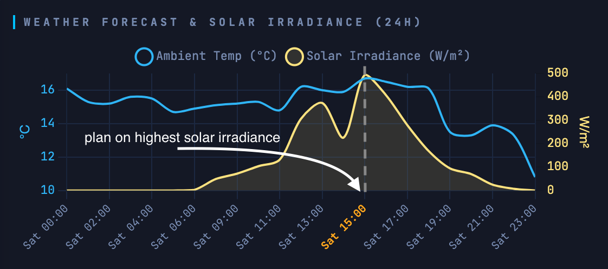

How this behaves depends on three variables: your **Target** (Setpoint), your hardware **Drop**, and ODIN's **Threshold**.

#### Example Numbers
To understand when ODIN triggers a DHW run, let's look at a tested setup with a 300L tank:
* **Target Setpoint:** 48°C
* **Hardware Drop:** 10°C (The limit where the heat pump *must* start)
* **ODIN Threshold:** 8.5°C (ODIN's planning buffer)

Using these numbers, we get two critical trigger points:
1. **The Hardware Minimum:** `Target - Drop` (48 - 10 = **38°C**). If the water hits this temperature, the heat pump ignores all schedules and starts heating immediately to protect your comfort.
2. **The ODIN Trigger:** `Hardware Minimum + Threshold` (38 + 8.5 = **46.5°C**). This is the temperature at which ODIN starts looking for a smart heating slot.

#### How the Algorithm Schedules the Slot
At the start of every hour, ODIN's optimization engine checks the current tank temperature. 

1. **Triggering the search:** As soon as the tank drops below the ODIN Trigger (e.g., someone washes their hands and it drops to 46.0°C), ODIN knows a DHW run will be needed soon.
2. **Finding the best slot:** The algorithm scans the upcoming hours in its planning window. It looks for the cheapest available spot—usually an hour with high solar coverage or very low grid prices—*before* it expects the tank to drop all the way to 38°C.
3. **Locking it in:** Once the optimal hour is found, the engine **locks in the DHW run first**. Because DHW requires the heat pump to run at high temperatures (meaning space heating is paused), ODIN secures the DHW slot and then builds the rest of the space-heating plan around it to ensure they do not clash.

#### Dynamic Adjustments & Hardware Overrides
Because ODIN recalculates every hour, the plan is highly dynamic. If ODIN schedules a DHW run for 14:00 (the cheapest solar hour), but someone takes a 15-minute shower at 11:00, the algorithm will instantly recalculate at 12:00 to see if it needs to move the heating slot closer.

**The Hardware Override:** ODIN can only optimize what it can foresee. If someone takes a massive, long shower and drains the tank rapidly down to 38°C (The Hardware Minimum), the physical drop point is reached. At this point, the heat pump starts automatically to recover the tank. ODIN cannot prevent this hardware safety mechanism, meaning that specific run will happen regardless of the current electricity price.

#### Opportunistic "Free" Heating
If electricity spot prices drop below zero (negative pricing), the algorithm overrides the normal threshold logic. It will opportunistically top up the hot water tank to its maximum target—even if the tank is only slightly depleted—because heating at that exact moment is genuinely free (or even pays you).

### Battery integration (Recommendation Only)

If you have a home battery, ODIN calculates how to best allocate your available battery charge to the most expensive heating hours of the day, within the discharge limit you have set. This reduces the estimated grid draw during price peaks and is factored into the cost forecast shown after each solve.

**Note:** ODIN currently only generates a discharge *schedule and recommendation*. It does not actively integrate with or control your battery hardware (yet). To actually discharge your battery according to this plan, you will need to use an external automation platform (like Home Assistant) to read ODIN's planned consumption and control your battery accordingly.

---

## 18. API Data Feeds — Pushing Prices & Weather

ODIN supports two HTTP POST endpoints that let an external system — such as Home Assistant, a Node-RED flow, or any script — push electricity prices and weather data directly to the device. This replaces the built-in automatic fetchers entirely and is useful when:

- You have a non-European energy contract or a custom tariff structure not supported by Energy-Charts or ENTSO-E
- You want to feed real sensor data (outdoor temperature from a local weather station, actual PV inverter output) instead of forecast estimates
- You integrate ODIN into a broader home automation platform that already aggregates this data

Both modes store their last payload in NVS flash, so ODIN restores the pushed data automatically after a reboot without needing an immediate re-push.

---

### Activating API Mode

Before pushing data, set the corresponding source to **API / Manual** in the dashboard Settings tab:

- **Prices:** set **Price Source** → `External API (HTTP POST)`
- **Weather:** set **Weather Source** → `Manual API (HTTP POST)`

Click **Apply Location & Energy** to save. Once active, ODIN's background scheduler will no longer overwrite the pushed data with automatic fetches.

> **Important:** In External API price mode, ODIN expects you to supply **all-in consumer prices** (spot price + energy tax + VAT already included) in €/kWh. The tax conversion that ODIN normally applies automatically is skipped for API-pushed prices.

---

### POST /api/data/prices

Pushes 24–48 hours of hourly electricity prices to ODIN.

**URL:** `http://<odin-ip>/api/data/prices`  
**Method:** `POST`  
**Content-Type:** `application/json`

#### Request body

```json
{
  "prices": [0.21, 0.19, 0.18, 0.17, 0.16, 0.15, 0.14, 0.13,
             0.15, 0.22, 0.28, 0.31, 0.29, 0.26, 0.24, 0.23,
             0.25, 0.30, 0.35, 0.38, 0.34, 0.28, 0.24, 0.22,
             0.20, 0.18, 0.17, 0.16, 0.15, 0.14, 0.13, 0.12,
             0.14, 0.21, 0.27, 0.30, 0.28, 0.25, 0.23, 0.22,
             0.24, 0.29, 0.33, 0.36, 0.32, 0.27, 0.23, 0.21]
}
```

| Field | Type | Required | Description |
|-------|------|----------|-------------|
| `prices` | array of floats | Yes | Hourly all-in electricity prices in **€/kWh**, starting from hour 0 of today. Minimum 24 values; 48 recommended. |

#### Rules

- Values must be in **€/kWh** including all taxes and VAT — not €/MWh raw spot prices.
- At least **24** values are required. Fewer returns HTTP 400.
- If exactly 24 values are supplied, tomorrow's hours (index 24–47) are padded with the average of today's prices.
- If 48 values are supplied, both today and tomorrow are fully specified — recommended.
- Prices are written to NVS immediately and survive a reboot.

#### Success response

```json
{ "success": true }
```

#### Home Assistant example (RESTful command)

```yaml
rest_command:
  push_odin_prices:
    url: "http://192.168.1.42/api/data/prices"
    method: POST
    content_type: "application/json"
    payload: >
      {"prices": {{ prices_list | tojson }}}
```

---

### POST /api/data/weather

Pushes 24–48 hours of hourly outdoor temperature and solar irradiance to ODIN.

**URL:** `http://<odin-ip>/api/data/weather`  
**Method:** `POST`  
**Content-Type:** `application/json`

#### Request body

```json
{
  "temps": [8.1, 7.6, 7.2, 6.9, 6.7, 6.5, 6.8, 7.4,
            8.3, 9.5, 10.8, 11.9, 12.6, 12.9, 12.7, 12.1,
            11.3, 10.4, 9.8, 9.3, 9.0, 8.7, 8.5, 8.2,
            8.0, 7.5, 7.1, 6.8, 6.6, 6.4, 6.7, 7.3,
            8.2, 9.4, 10.7, 11.8, 12.5, 12.8, 12.6, 12.0,
            11.2, 10.3, 9.7, 9.2, 8.9, 8.6, 8.4, 8.1],
  "solar": [0, 0, 0, 0, 0, 0, 0, 15,
            95, 210, 340, 430, 480, 460, 400, 310,
            200, 90, 20, 0, 0, 0, 0, 0,
            0, 0, 0, 0, 0, 0, 0, 18,
            100, 215, 345, 435, 485, 465, 405, 315,
            205, 95, 22, 0, 0, 0, 0, 0]
}
```

| Field | Type | Required | Description |
|-------|------|----------|-------------|
| `temps` | array of floats | Yes | Hourly outdoor air temperature in **°C**, starting from hour 0 of today. Minimum 24 values; 48 recommended. |
| `solar` | array of floats | Yes | Hourly solar irradiance in **W/m²**, plane-of-array (POA) — i.e. already corrected for your panel tilt and orientation. Minimum 24 values; 48 recommended. Negative values are clamped to 0. |

#### Rules

- Both `temps` and `solar` must be present. Missing either returns HTTP 400.
- At least **24** values are required for each array. Fewer returns HTTP 400.
- If exactly 24 values are provided, tomorrow's hours are padded: temperature uses the array average, solar uses `0` (safest assumption for missing hours).
- If 48 values are provided, both today and tomorrow are fully specified — recommended.
- Solar values are irradiance in **W/m²**, not production in kWh. ODIN multiplies by your configured `Solar Capacity (kWp)` and `Hardware Efficiency (PR)` to derive expected hourly production.
- If you are supplying data from a local weather station that measures horizontal (GHI) irradiance rather than tilted-plane (POA), you will need to transpose it yourself before pushing — or use the Open-Meteo automatic source which performs this server-side.
- Data is written to NVS immediately and survives a reboot.

#### Success response

```json
{ "success": true }
```

#### Home Assistant example (RESTful command)

```yaml
rest_command:
  push_odin_weather:
    url: "http://192.168.1.42/api/data/weather"
    method: POST
    content_type: "application/json"
    payload: >
      {"temps": {{ temps_list | tojson }}, "solar": {{ solar_list | tojson }}}
```

---

### Error responses

Both endpoints return standard HTTP error codes:

| Code | Meaning |
|------|---------|
| `400 Bad Request` | Malformed JSON, missing array field, or fewer than 24 values supplied |
| `408 Request Timeout` | Connection dropped during upload |
| `500 Internal Server Error` | Device out of memory (should not occur under normal conditions) |

---

### Scheduling pushes

Both endpoints are stateless — push whenever your data updates. Recommended practice:

- **Prices:** push once daily, shortly after day-ahead prices are published (typically 13:00–14:00 CET). Push 48 values covering today and tomorrow.
- **Weather:** push once per hour (or every 30 minutes) so ODIN always has the freshest forecast before its hourly solve. Each push overwrites the previous data.

> **Tip:** In Home Assistant, a Time-based automation that calls `rest_command.push_odin_prices` at 14:15 and `rest_command.push_odin_weather` every hour on the :55 mark (five minutes before ODIN's hourly solve) is a reliable and low-overhead integration pattern.

## 19. Factory Reset

If you need to restore ODIN to its original settings, follow these steps:

1. Press and hold the boot button.
2. Keep the button pressed until the status LED turns solid blue, then release.
3. The LED will flash red and blue while the device erases all data.